## A Collaborative Effort

::: {.columns}

::: {.column width="33%"}
{width=80%}

**Giulio Franzese**
 <small>Eurecom</small>
:::

::: {.column width="33%"}
{width=70%}

**Pietro Michiardi**
 <small>Eurecom</small>
:::

::: {.column width="33%"}
{width=80%}

**Mustapha Bounoua**
 <small>Eurecom</small>
:::

:::

::: {.columns}

::: {.column width="33%"}
.jpg){width=80%}

**Chao Wang**
 <small>Eurecom</small>
:::

::: {.column width="33%"}
{width=70%}

**Alberto Foresti**
 <small>Eurecom / Politecnico di Torino</small>
:::

::: {.column width="33%"}
{width=70%}

**Luca Nepote**
 <small>Eurecom</small>
:::

:::

---

## Information Theory Across Scales of Brain Biology

**Shannon's answer** (1948): use **Mutual Information** — the unique measure that quantifies statistical dependence in bits, regardless of the shape of the distribution.

The same framework answers interconnected questions at every scale of neuroscience and organoid biology:

|  | Question | Scale | Tool |
|--|---|---|---|
| **1** | How much does a neuron's firing tell us about a stimulus? | Systems | MI |
| **2** | Which brain area is *driving* which? | Circuits | Transfer Entropy |
| **3** | Do populations code *redundantly* or *synergistically*? | Networks | O-Information |
| **4** | How much does gene expression predict cell fate? *(Weinreb et al. 2020)* | Organoid / single-cell | MI |
| **5** | What causal structure governs gene regulatory networks? *(Clonotrace 2025)* | Organoid / genomics | Transfer Entropy |

The challenge: these quantities are **hard to estimate** from real data — nonlinear distributions, high dimensions, mixed data types. We'll show how **diffusion processes** provide a unified solution.

---

## Information Theory Is Reshaping Biology

These tools are not just theoretical — they are already an **established quantitative language** in several active research lines, offering capabilities that correlation-based methods cannot match. Think of them as **software-defined instruments**: just as a microscope reveals spatial structure, MI/TE/O-Information reveal *statistical structure* inaccessible to classical statistics.

**Already in use across the organoid and single-cell field:**

<table style="font-size:0.78em; width:100%; border-collapse:collapse;">
<tr style="background:#f0f4ff;"><th style="text-align:left; padding:4px 8px;">Paper</th><th style="text-align:left; padding:4px 8px;">What they measured</th><th style="text-align:left; padding:4px 8px;">Tool</th></tr>
<tr><td style="padding:3px 8px;">Muccitri et al. 2024</td><td style="padding:3px 8px;">Functional connectivity in organoid HD-MEA</td><td style="padding:3px 8px;"><b>MI</b> as network edge weight</td></tr>
<tr style="background:#f9f9f9;"><td style="padding:3px 8px;">Weinreb et al. 2020</td><td style="padding:3px 8px;">Hidden epigenetic fate determinants in sister cells</td><td style="padding:3px 8px;"><b>MI</b> between clonal pairs</td></tr>
<tr><td style="padding:3px 8px;">Teschendorff 2017 (SCENT)</td><td style="padding:3px 8px;">Stem cell differentiation potency</td><td style="padding:3px 8px;">Signaling <b>entropy</b> rate</td></tr>
<tr style="background:#f9f9f9;"><td style="padding:3px 8px;">Uthamacumaran et al. 2024</td><td style="padding:3px 8px;">Information integration in Xenobot morphogenesis</td><td style="padding:3px 8px;"><b>MI</b> functional connectivity</td></tr>
<tr><td style="padding:3px 8px;">DeepTracing 2024</td><td style="padding:3px 8px;">Lineage vs cell-state disentanglement in scRNA-seq</td><td style="padding:3px 8px;"><b>Total Correlation</b> regulariser</td></tr>
<tr style="background:#f9f9f9;"><td style="padding:3px 8px;">Clonotrace 2025</td><td style="padding:3px 8px;">Shared programs across independent lineages</td><td style="padding:3px 8px;"><b>MI</b> between clonal and transcriptomic identity</td></tr>
</table>

**The bottleneck**: existing estimators assume Gaussian data, low dimensions, or continuous variables — none of which hold for high-dimensional neural recordings, zero-inflated scRNA-seq, or nonlinear physiological signals.

::: {.callout-important appearance="minimal"}
The field has the **questions** and the **data** — it is missing scalable, nonparametric **estimators**. That is what this talk is about.
:::

---

## What We Will Show

**Five software instruments — one diffusion framework, all with running code:**

| Method | Quantity | Data type | Validated on |
|---|---|---|---|
| **MINDE** *(ICLR 2024)* | $I(A;B)$ | Continuous | SotA benchmark across distribution families |
| **INFO-SEDD** *(ICLR 2025)* | $I(A;B)$ | **Discrete** | DNA promoter motif discovery (*Arabidopsis*) |
| **DDMEC** *(ICML 2025)* | $\max_\pi I(X;Y)$ | Unpaired multimodal | PBMC ATAC-seq ↔ RNA-seq alignment |
| **SOI** *(ICML 2024)* | $\Omega(X_1,\ldots,X_N)$ | Multivariate | VBN visual cortex (6 areas, Neuropixels) |
| **TENDE** *(preprint)* | $\mathrm{TE}_{X\to Y}(k,\ell)$ | Time series | Respiratory sinus arrhythmia recovery |

**The unifying insight**: replace intractable measure-theoretic integrals with learnable *score functions* trained via self-supervised denoising — the same machinery behind Stable Diffusion, repurposed for information theory.

# Introduction

## Definition of Mutual Information

The mutual information between two random variables $X$ and $Y$ (or stochastic processes) is defined as:

$$\textsc{I}(X; Y) = \mathbb{E} \left[ \log \frac{d\mu^{X,Y}}{d\mu^X d\mu^Y} \right]$$

where:

- $\mu^{X,Y}$ is the joint probability **measure** of $X$ and $Y$.
- $\mu^X$ and $\mu^Y$ are the marginal measures.

The same definition holds when $X$ and $Y$ are stochastic processes.

---

## Mutual Information as a Fundamental Measure

- Mutual information is a fundamental measure of statistical dependence between random variables.
- Imagine an omnipotent Daemon observing streams of data: **either** from the joint distribution $\mu^{X,Y}$ **or** from the product of the marginals $\mu^X \mu^Y$.
- Mutual information quantifies the rate at which the daemon can distinguish between these two cases.
- In practical terms:
  - For discrete random variables, MI provides fundamental bounds on classification accuracy (e.g. how well can we decode a stimulus from a neural population response?).
  - For continuous variables, it sets limits on estimation variance.
- **We will see later** how this directly quantifies redundancy vs. synergy across visual cortex areas in mice — without any parametric assumption on neural firing distributions.

---

## Interpretation of Mutual Information

- In a communication system, MI measures how much information about a message is retained after transmission through a noisy channel.
- **Neuroscience translation**: the stimulus is the "message", the neural response is the "received signal". $\textsc{I}(\text{stimulus};\text{response})$ directly quantifies the neuron's coding fidelity — in bits.
- Applications in neuroscience: neural coding efficiency, information bottleneck in sensory hierarchies, functional connectivity, consciousness research.

::: {.bio-conclusion}
- **Cell fate prediction**: Weinreb et al. (*Science*, 2020), studying mouse hematopoiesis, used MI between sister cells to provide evidence that cell fate is influenced by *hidden* biological states — likely epigenetic or metabolic in nature — not fully captured by single-cell RNA-seq snapshots.
- **Gene regulatory networks**: MI between gene pairs underpins GRN inference methods (ARACNE, MRNET) — reconstructing transcription factor–target relationships — approaches applicable, in principle, to developing organoid tissue.
:::

---

## Why Not Just Use Correlation?

Pearson correlation $\rho(X,Y) = \frac{\operatorname{Cov}(X,Y)}{\sigma_X \sigma_Y}$ is ubiquitous — but it fundamentally fails in neural data settings:

::: {.fragment}
- **Nonlinearities**: neurons have sigmoidal transfer functions, threshold and saturation effects. A neuron can be maximally informative about a stimulus yet have *zero* linear correlation with it — as occurs when the tuning curve is symmetric about the stimulus mean.
:::

::: {.fragment}
- **The XOR problem**: let $X, Y$ be independent fair coin flips, $Z = X \oplus Y$ (XOR). Then $\rho(X,Z)=\rho(Y,Z)=0$ — yet $I(X;Z) > 0$. This is precisely *synergistic coding*: the pair $(X,Y)$ jointly encodes $Z$, but neither alone does. This arises naturally in multi-neuron recordings.
:::

::: {.fragment}
- **Mixed data types**: neural recordings mix spike counts (discrete, Poisson-like), local field potentials (continuous), and behavioural variables (categorical). Correlation requires a common scale; MI is defined uniformly for *any* pair of measures.
:::

::: {.fragment}
- **scRNA-seq count data**: gene expression counts are discrete, zero-inflated, and heavily skewed. Pearson correlation on raw or log-normalised counts systematically misses nonlinear co-regulation. MI is defined directly on the count distribution, no normalisation required.
:::

::: {.fragment}
::: {.bio-conclusion}
- **Hidden-state evidence (hematopoiesis)**: Weinreb et al. (*Science*, 2020), studying hematopoietic differentiation, showed that early transcriptomic similarity between sister cells had low predictive power for differential fate outcomes — yet MI between sister-cell fate trajectories grew over time, consistent with hidden biological states shaping fate beyond what the transcriptome alone captures. MI provided a signal where linear methods were insufficient.
:::
:::

::: {.fragment}
::: {.bio-conclusion}
- **Beyond neurons**: Uthamacumaran et al. (2024) applied MI-based connectivity to *aneural* morphogenetic tissue (Xenopus epidermis), revealing organised information structures invisible to correlation — these tools show promise beyond neural tissues, suggesting broader applicability across developing biological systems.
:::
:::

---

## Technical Simplification

To lighten up the notation, we present results for *generic* Kullback-Leibler divergences:

$$\KL{\mu}{\rho}\defeq \int\phi\!\left(\frac{d\mu}{d\rho}\right)d\rho,\quad \text{with}\quad \phi(x)=x\log(x)$$

Trivial exercise: show that $\textsc{I}(A,B)=\KL{\mu^{A,B}}{\mu^{A}\mu^{B}}$

---

## Mutual Information Estimators...?

More than 80 years of research in three sentences:

- For Continuous RVs *approximate* the distributions as Gaussian, Laplace (insert anything which gives easy to compute formulas) and compute MI, e.g.
$$p(x,y)\simeq \mathcal{N}\!\left(\mu,\begin{bmatrix}\Sigma_{XX} &\Sigma_{XY}\\\Sigma_{XY}^\top &\Sigma_{YY}\end{bmatrix}\right) \;\rightarrow\; \textsc{I}(X,Y)=\tfrac{1}{2}\log\!\left(\frac{\det(\Sigma_{YY})\det(\Sigma_{XX})}{\det(\Sigma)}\right)$$
- For Discrete random variables, estimate the histogram of joint occurrences from dataset $\{x_i,y_i\}_{i=1}^N$, store them in a large matrix, and compute
$$\hat{H}=\frac{1}{N}\begin{bmatrix} \#(x_i=0,y_i=0) &\dots & \#(x_i=0,y_i=M) \\ \vdots & & \vdots \end{bmatrix}, \quad \hat{I}=\sum_{j,k}\hat{H}_{j,k}\log \hat{H}_{j,k}$$
- Combine the approaches (binning, clustering prototypes, etc...)

---

## Mutual Information Estimators...? (cont.)

**Problem**: classical estimators fail in high dimensional scenarios necessitating advanced estimation methods like neural estimators.

- Two main families of neural approaches:
  - **Discriminative**: a classifier distinguishes between samples from the joint ($\sim \mu^{A,B}$) or product of marginals ($\mu^A \mu^B$)
  - **Generative (likelihood based)**: fit parametrically $\mu^{A,B}$ and estimate MI using Monte Carlo Methods
- **Problem:** many existing neural estimators fail on challenging (long-tailed distributions) and do not pass *consistency tests*.

---

## Mutual Information Estimators...? (cont.)

Discriminative approaches in one slide (convex duality of $\phi(\cdot)$):

$$\phi^{*}(y)=\sup_{x}(xy-\phi(x)),\quad \phi^{**}(x)= \sup_{y}(yx-\phi^{*}(y)),\quad \phi^{**}(x)=\phi(x)$$

- **Donsker-Varahdan Thm:**
$$\KL{\mu}{\chi}=\sup_{T:\Omega\rightarrow\mathbb{R}}\E_\mu[T]-\log \E_\chi [\exp(T)]$$

- From all possible functions $T$ to the smaller class of *neural networks*:
$$\sup_{T:\Omega\rightarrow\mathbb{R}}(\E_\mu[T]-\log \E_\chi [\exp(T)])\geq \sup_{\theta\in \mathbb{R}^K}(\E_\mu[T^\theta]-\log \E_\chi [\exp(T^\theta)])$$

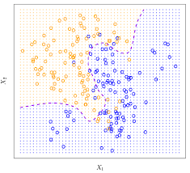{width=65%}

- **Big problems**: i) Good luck with MC estimation of $\log \E [\exp(T^\theta)]$; ii) For tail events, estimation is unreliable.

# Estimation via Diffusion {.center}

::: {style="font-size:0.75em; color:#666; margin-top:0.5em;"}
**MINDE** → INFO-SEDD → DDMEC → SOI → TENDE
:::

## The Diffusion Idea — An Intuition

::: {.columns}
::: {.column width="55%"}
**Step 1 — Forward process (noising):**

Any distribution $p(x)$ converges to a Gaussian when you repeatedly add small amounts of noise.

$$x_t = e^{-t}\,x_0 + \sqrt{1 - e^{-2t}}\;\varepsilon, \quad \varepsilon \sim \mathcal{N}(0,I)$$

- At $t=0$: the original data distribution.
- At $t\to\infty$: pure Gaussian noise.
- The trajectory in between is fully tractable.

**Step 2 — Score function = compass toward data:**

$$\nabla_x \log p_t(x) \;\;\text{"points toward high-density regions"}$$

- Intuitively: a noisy sample $x_t$ "knows" where $x_0$ came from.
- The score is proportional to the **optimal denoiser** (Tweedie's formula):

$$\nabla_x \log p_t(x) = \frac{e^{-t}\,\mathbb{E}[x_0 \mid x_t] - x_t}{1 - e^{-2t}}$$
:::
::: {.column width="45%"}
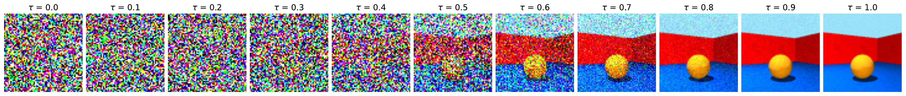{width=100%}

**Step 3 — Learn the score, get MI for free:**

Train a neural network to denoise (self-supervised):
$$\mathcal{L}(\theta) = \mathbb{E}\!\left[\|\text{net}_\theta(x_t, t) - x_0\|^2\right]$$

The gap between two denoisers encodes the KL divergence — and therefore the Mutual Information.
:::
:::

---

## Introduction

- Consider a generic random variable $A$ with probability measure $\mu^A$
- Build a simple SDE in $[0,T]$ with initial conditions $\sim \mu^A$:
$$\begin{cases}\dd X_t=-X_t\,\dd t+\sqrt{2}\,\dd W_t,\\ X_0=A\sim \mu^A\end{cases}$$
where $W_t$ is a Brownian motion. **Informally**, $\dd W_t\sim \mathcal{N}(0,\dd t)$

- For engineers/physicists:
$$\frac{\dd X_t}{\dd t}=-X_t+\sqrt{2}\underbrace{\frac{\dd W_t}{\dd t}}_{N_t,\,\text{White Noise}}$$
(even simpler: $X_t=h_t\star N_t$). We need measure theory and stoch. integrals for nonlinear drifts, etc...

- This SDE corresponds to a path measure $\mathbb{P}^{A}$ (**informally** events like $\text{Pr}(X_{0\leq t\leq T}\in \mathcal{S})$).

---

## Introduction (cont.)

- Two SDEs which differ only by initial conditions have KL divergence:
$$\KL{\mathbb{P}^{A}}{\mathbb{P}^{B}}=\E_{\mathbb{P}^{A}}\!\left[\log\frac{d\mathbb{P}^{A}}{d\mathbb{P}^{B}}\right]=\E_{\mathbb{P}^{A}}\!\left[\log\frac{d\mu^{A}}{dp^{B}}\right]=\KL{\mu^A}{\mu^B}$$

- Disintegration of measures explains why (simply Markov):
$$\frac{d{P}^{A}}{d{P}^{B}}=\frac{d\mu^A(X_{0})}{d\mu^B(X_{0})}$$

---

## Introduction (cont.)

**Time-reversal** $\hat{X}_t\defeq X_{T-t}$:

- KL between path measures is invariant to time-reversal: $\KL{\mathbb{P}^{A}}{\mathbb{P}^{B}}=\KL{\hat{\mathbb{P}}^{A}}{\hat{\mathbb{P}}^{B}}$
- Time reversal of SDE is again an SDE (provided technical conditions [Léonard 2014]):
$$\dd \hat X_t=\hat X_t+2 \underbrace{\nabla\log \frac{d\mu_{T-t}^A}{dx}(\hat X_t)}_{\text{score function!}}\dd t+ \sqrt{2}\,\dd \hat W_t$$
with $dx$ the Lebesgue measure.
- Score function $\leftrightarrow$ Denoiser:
$$\nabla\log \frac{d\mu_t^A}{dx}(x)=\nabla\log p^A_t(x)=\frac{\exp(-t)\,{\color{red}\E_{{\mathbb{P}^{A}}}[X_0\mid X_t=x]}-x}{1-\exp(-2t)}$$

---

## Introduction (cont.)

**Girsanov theorem**: (informal) express the KL between path measures corresponding to two SDEs with different drifts.

$$\KL{\hat{\mathbb{P}}^{A}}{\hat{\mathbb{P}}^{B}}\simeq  \E_{\mathbb{P}^{\mu^A}}\!\left[\int_0^T\norm{\nabla\log p^{A}_t(X_t)-\nabla\log p^{B}_t(X_t)}^2\dd t\right]$$

- Combining with $\KL{\mathbb{P}^{A}}{\mathbb{P}^{B}}=\KL{\hat{\mathbb{P}}^{A}}{\hat{\mathbb{P}}^{B}}$ we can obtain a KL-estimator!

---

## Introduction (cont.)

... but do we know the score? In general, **no**.

**Solution** → parametric denoiser (score network):
$$\mathcal{L}(\theta)=\E[\norm{\text{net}_\theta(X_t,t)-X_0}^2]$$

Remember $X_0=A$. Basically a self-supervised procedure:

- Start with a dataset.
- Corrupt it with various levels of noise.
- Try to learn a proper denoiser.

---

## Score-based Generative Models?

::: {.columns}
::: {.column width="52%"}
The time reversal of diffusion processes is currently one of the main ingredients behind the extremely popular **generative AI** models (Stable Diffusion, DALL·E, Sora...).

These models are trained to **denoise** — which means they implicitly learn the score $\nabla \log p_t(x)$ at every noise level.

::: {.callout-tip appearance="minimal"}
**Our key insight**: we *repurpose* this powerful machinery — originally developed for image synthesis — to estimate **Mutual Information**. No generative output needed; we only care about the score functions learned during training.

The billions of dollars invested in scaling diffusion models also advance our ability to compute information-theoretic quantities on complex biological data.
:::
:::
::: {.column width="48%"}
{width=100%}
:::
:::

---

## Mutual Information Neural Diffusion Estimation

::: {.columns}
::: {.column width="50%"}
Mutual Information between two random variables $A,B$:

$$\textsc{I}(A,B)=\KL{\mu^{A,B}}{\mu^A\mu^B}$$

Two families of diffusion processes: **joint (J)** and **conditional (C)**.

$$\begin{cases}\dd [X_t,Y_t]^\top =-[X_t,Y_t]^\top \dd t+ \sqrt{2}\,[\dd W_t,\dd W'_t]^\top\\ [X_0,Y_0]^\top\sim \mu^{A,B}\end{cases}$$

The joint and marginal scores are the only ingredients needed — train a single network, query it twice.
:::
::: {.column width="50%"}
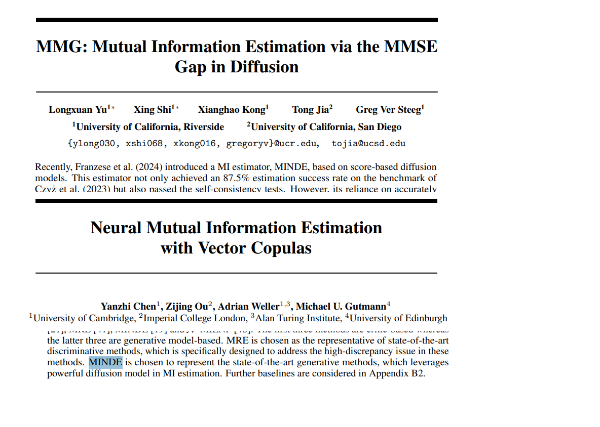{width=100%}
:::
:::

---

## Mutual Information Neural Diffusion Estimation (cont.)

First family, **MINDE-C**:

::: {.callout-note appearance="minimal" title="Algorithm: Estimate Mutual Information using Diffusion Models"}
1. $[A, B] \sim \mu^{A,B}$ &nbsp;&nbsp; ▷ Sample from joint distribution
2. $t \sim \mathcal{U}[0, T]$ &nbsp;&nbsp; ▷ Uniformly sample $t$ from $[0,T]$
3. $X_t \gets \exp(-t)A + \sqrt{1-\exp(-2t)}\,\epsilon$, where $\epsilon \sim \mathcal{N}(\mathbf{0},\boldsymbol{I})$ &nbsp;&nbsp; ▷ Simulate diffusion
4. $s^{A} \gets \text{net}_\theta([X_t, 0], t, c=0)$ &nbsp;&nbsp; ▷ Compute unconditional score
5. $s^{A_{B}} \gets \text{net}_\theta([X_t, B], t, c=1)$ &nbsp;&nbsp; ▷ Compute conditional score
6. $\hat{I} \gets T\left\| s^{A}-s^{A_{B}} \right\|^2$ &nbsp;&nbsp; ▷ Estimate MI
:::

---

## The Route Matters, Not Just the Endpoints

::: {.columns}
::: {.column width="55%"}
The Mississippi's source and mouth are fixed — yet its path meanders unpredictably across thousands of miles.

In **trajectory inference**, we observe cell populations at a few snapshots. Standard metrics (W₂, MMD) compare those snapshots — but infinitely many paths connect the same marginals. **The route is invisible to marginal metrics.**

We need a metric defined on *distributions over paths*, not distributions at individual timepoints.
:::
::: {.column width="45%"}
{width=100%}
:::
:::

---

## MINDE in Infinite Dimensions: Trajectory-Level KL

::: {.columns}
::: {.column width="50%"}
**The single-cell trajectory problem**

scRNA-seq gives population *snapshots* at a few timepoints — but not trajectories. Trajectory inference methods reconstruct full paths $X_{[0,1]}$ from these snapshots.

**The evaluation gap**: standard metrics compare *marginals* only. Infinitely many path measures produce identical marginals.

{width=100%}
:::
::: {.column width="50%"}
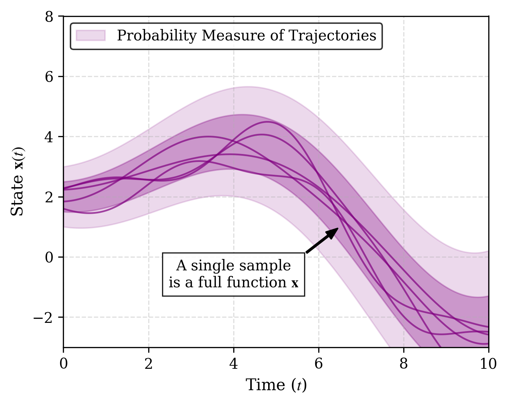{width=100%}

::: {.callout-tip appearance="minimal"}
**Key insight**: extend MINDE to function spaces. The KL between two trajectory distributions reduces to an integral of squared velocity field differences:
$$\mathrm{KL}(\nu^A \| \nu^B) = \int_0^1 \!\int_H \frac{t}{1-t}\, \|v^A_t(x) - v^B_t(x)\|^2_{H_{\mu_0}}\, d\mu^A_t\, dt$$
where $v^A_t, v^B_t$ are the velocity fields of the two path measures — learnable via flow matching.
:::
:::
:::

---

## Trajectory KL Exposes What Marginal Metrics Miss

::: {.columns}
::: {.column width="48%"}
**The petal dataset** — a synthetic trajectory benchmark mimicking cell differentiation (branching, merging).

At $\tau = 0.75$: MSBM and TIGON score nearly identically by Wasserstein distance ($W_2 = 0.160$ vs $0.155$). Marginal metrics declare them equivalent.

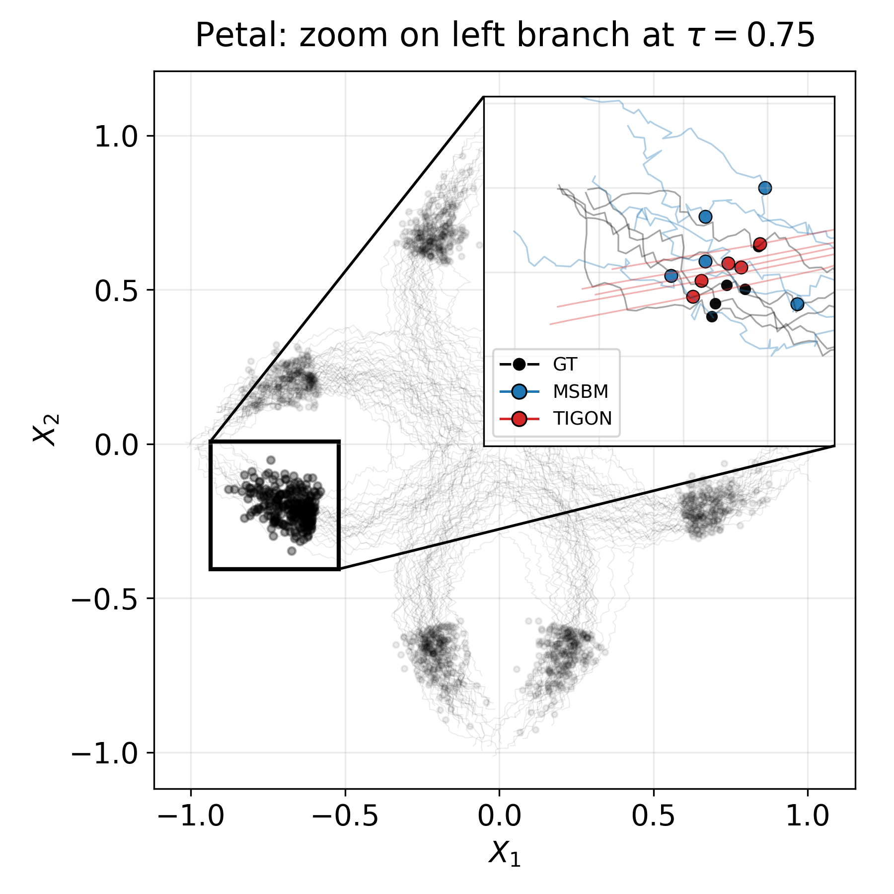{width=100%}
:::
::: {.column width="52%"}
**FKL correctly separates them** — and is validated against analytical ground truth on Gaussian path measures:

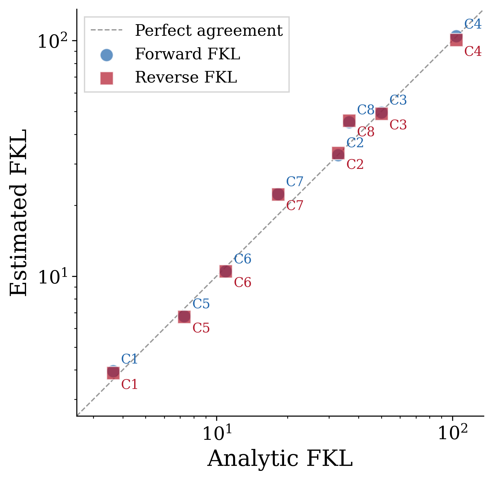{width=100%}

::: {style="font-size:0.82em; color:#444; margin-top:0.3em;"}
**Forward KL** penalises missing coverage; **Reverse KL** penalises hallucination. TIGON has forward ≈ reverse on petal (no hallucination) but both are high — it simply generates wrong dynamics. AM on the Repressilator has reverse KL $= 435$ vs forward $= 27$: pure hallucination, invisible to marginal metrics.
:::
:::
:::

---

## Continuous Time Markov Chains: Conquering Discrete Spaces

- Consider a **discrete** random variable $A\in \chi = \{1,\hdots,N\}$ with probability measure $\mu^A$ (discrete state spaces, conflate with $p^A$)
- Build a CTMC in $[0,T]$ with initial conditions $\sim p^A$:
$$\frac{d p^A_t(x)}{dt}=Q_t p^A_t(x)$$
- The infinitesimal generator $Q_t$ is now a matrix, whereas it was a differential operator in $\mathbb{R}^N$. Think e.g. of Queuing Theory, Epidemic Models, or **scRNA-seq count data from organoids at successive developmental stages** — each gene expression level is a discrete state, and differentiation is a Markov transition between them.
- We can adapt the previous calculations. Then $\KL{p_0}{q_0}=$
$$\mathbb{E}\!\left[\int_0^T\sum_{x\neq X_t} Q_{t}(X_t,x)\!\left(K\!\left(\frac{p_t(x)}{p_t(X_t)}\right)+\frac{q_t(x)}{q_t(X_t)}-\frac{p_t(x)}{p_t(X_t)}\log\frac{q_t(x)}{q_t(X_t)}\right)dt\right]$$
where $K(a)=a(\log(a)-1)$. The ratio $\frac{p_t(x)}{p_t(y)}$ is called the *discrete score* — approximated with a neural network.

---

## Continuous Time Markov Chains (cont.)

::: {.columns}
::: {.column width="48%"}
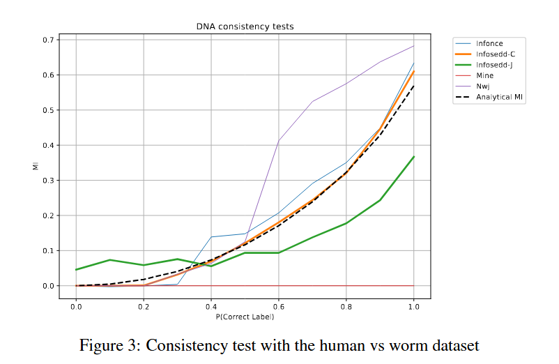{width=100%}
:::
::: {.column width="52%"}
**What MI is computed**: $I(\text{Window}_{[i,i+6)};\, \text{Label})$ — the information that a 6-bp DNA window carries about whether the sequence is a promoter or not. The window slides from −200 bp to +51 bp relative to the TSS.

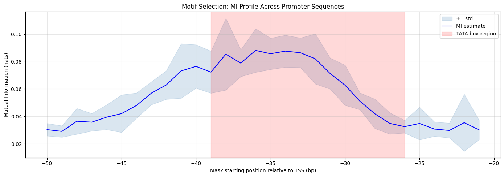{width=100% style="object-fit:contain; max-height:300px;"}
:::
:::

---

## INFO-SEDD Unlocks Discrete Biology

Classical MI estimators assume continuous data — but biology is full of **discrete signals**. INFO-SEDD handles them natively:

::: {.columns}
::: {.column width="55%"}
**DNA regulatory elements** *(right figure)*

**Quantity**: $I(\underbrace{\text{6-bp window}}_{\text{discrete, }|\Sigma|=4},\;\underbrace{\text{promoter?}}_{\text{binary label}})$ estimated as the window slides −200 → +51 bp from the TSS.

- Dataset: *Arabidopsis thaliana* promoters (EPDnew) vs. matched genomic background — 251-bp sequences, no motif labels provided
- The TATA-box (−39 to −26 bp) emerges as the MI peak **without any supervision** — the model learns that this window is maximally informative about promoter identity
- **What this unlocks**: unsupervised, sequence-only discovery of regulatory grammar. Apply the same scan to human neuronal enhancers or organoid ATAC-seq peaks to find which sequence motifs drive cell-type-specific chromatin accessibility.

**scRNA-seq count data** *(potential application)*

- Counts $\in \{0,1,2,\ldots\}$ are integer-valued — standard continuous MI estimators require continuous approximations that distort zero-inflation
- INFO-SEDD computes $I(\text{gene}_i;\, \text{gene}_j)$ on raw integer counts, no log-normalisation needed
- **What this unlocks**: nonparametric GRN inference from organoid single-cell atlases without Gaussian assumptions
:::
::: {.column width="45%"}
{width=100%}

::: {style="font-size:0.8em; color:#444; margin-top:0.5em;"}
MI ± 1σ across 80 batches of 16 sequences. Red band: known TATA-box region (−39 to −26 bp). Peak recovered with no motif labels.
:::
:::
:::

---

## Unpaired Data Problem

- Multimodal learning often assumes the availability of paired data.
- However, real-world data is frequently **unpaired across modalities**.

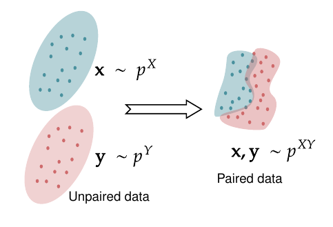{width=65%}

---

## Unpaired Data Problem (cont.)

Given two marginals $\mu^{X}$ and $\mu^{Y}$, find a joint distribution $\mu^{XY}$ that satisfies:

- The marginal constraints: $\mu^{XY}(S\times \mathbb{R}^N)=\mu^{X}(S),\;\mu^{XY}(\mathbb{R}^N\times S)=\mu^{Y}(S)$
- **Maximise the Mutual Information** $I(X;Y)$ between the two modalities!

**What MI is computed**: $I(X;Y) = \KL{\mu^{XY}}{\mu^X \mu^Y}$ — how much knowing one modality reduces uncertainty about the other. Maximising this over all valid couplings finds the pairing where the two distributions are *most statistically dependent* — i.e., where they share the most information.

**Why MI-maximisation, not just Optimal Transport?**

Optimal Transport finds a *geometrically close* coupling — it minimises the cost of moving mass from $\mu^X$ to $\mu^Y$. But closeness in gene-expression space $\neq$ biological correspondence: a chromatin-open cell and an actively-transcribing cell may look distant by $L^2$ distance yet be the same cell state. MI-maximisation finds the coupling where knowing one modality maximally reduces uncertainty about the other — a **biological correspondence principle**, not a geometric one.

---

## Unpaired Data: Demonstrated Results

DDMEC can pair any two unpaired distributions — demonstrated on image domains:

::: {.columns}

::: {.column width="48%"}

**Source**

**Output**

{width=100%}

{width=100%}

{width=100%}

{width=100%}

{width=100%}

{width=100%}

{width=100%}

{width=100%}

:::

::: {.column width="4%"}
:::

::: {.column width="48%"}

**Source**

**Output**

{width=100%}

{width=100%}

{width=100%}

{width=100%}

{width=100%}

{width=100%}

{width=100%}

{width=100%}

:::

:::

---

## Unpaired Data: Application to Single-Cell Multi-Omics

The same principle applies to **organoid multi-omics**: aligning **ATAC-seq** (chromatin accessibility) with **RNA-seq** (gene expression) from the same organoid population — **without** paired single-cell measurements.

::: {.columns}
::: {.column width="47%"}
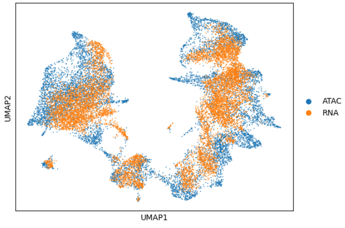{width=100%}
:::
::: {.column width="53%"}
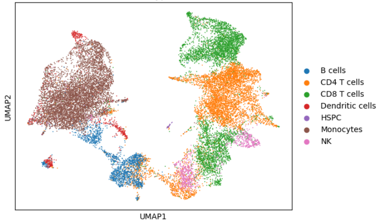{width=100%}
:::
:::

::: {style="font-size:0.85em; color:#444;"}
*DDMEC demonstrated on PBMC single-cell data. Applied to organoids, this methodology could enable joint chromatin + transcriptome analysis without the experimental overhead of paired profiling — though biological validity of the MI-maximised coupling in this context would require validation.*
:::

# Multivariate Information Theory {.center}

::: {style="font-size:0.75em; color:#666; margin-top:0.5em;"}
MINDE → INFO-SEDD → DDMEC → **SOI** → **TENDE**
:::

## Multimodal Information Theory

- Recently, the concept of MI has been extended to higher-order interactions: [**Redundant**]{style="color:blue"}, [**Synergistic**]{style="color:red"} and [**Unique**]{style="color:green"} Information. Seminal works by Williams and Beer (Partial Information Decomposition). Extremely important in consciousness studies.

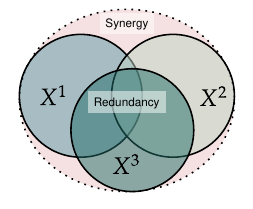{width=55%}

**Already used in organoid biology:**

- **DeepTracing** (2024): uses *Total Correlation* — a key component of O-Information — as a regularization term to disentangle *heritable lineage constraints* from *intrinsic cell-state dynamics* in organoid scRNA-seq. TC penalises statistical dependence between latent variables, enforcing clean separation.
- **SCENT** (Teschendorff et al. 2017): estimates *signaling entropy rate* from transcriptomic data integrated with a protein-protein interaction network. High entropy → pluripotent; low entropy → committed fate. A practical information-theoretic potency score for stem cells.

---

## Multimodal Information Theory (cont.)

Applications: **Multimodal sensory** neuroscience — and increasingly, **organoid development**.

::: {.columns}
::: {.column width="50%"}
.PNG){width=100%}
:::
::: {.column width="50%"}
.PNG){width=100%}
:::
:::

**Organoid angle**: the same decomposition applied to multi-electrode or calcium imaging data during organoid maturation can reveal whether developing circuits build *redundant* (fault-tolerant) or *synergistic* (integrative) coding strategies.

---

## O-Information

Analyzing systems with more than two variables. Example of metric: **O-Information**.

::: {.columns}
::: {.column width="60%"}
$$\Omega(X) = T(X) - D(X)$$
where $T(X) = \sum_{i=1}^{N} H(X_i) - H(X)$ is the **Total Correlation** and $D(X) = H(X) - \sum_{i=1}^{N} H(X_i | X_{\backslash i})$ is the **Dual Total Correlation**.

- $\Omega > 0$: **redundancy** dominates — each variable independently carries overlapping information
- $\Omega < 0$: **synergy** dominates — variables jointly encode information no single one carries alone

Nice properties, but out of reach unless data are Gaussian (or "*simple*") and/or discrete. The Hasse diagram (right) shows the full lattice of information atoms underlying the decomposition.
:::
::: {.column width="40%"}
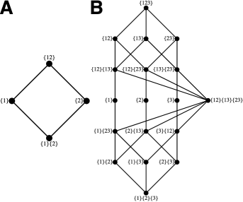{width=100%}
:::
:::

---

## O-Information (cont.)

::: {.columns}
::: {.column width="55%"}
Real neural data — including organoid MEA recordings — does not follow a known parametric distribution. The marginal density of a single visual cortex area (right) is multimodal, skewed, and heavy-tailed.

**Gaussian O-information estimators would be wrong by construction.** A nonparametric, score-based approach is the only option that does not require assuming a distribution family.
:::
::: {.column width="45%"}
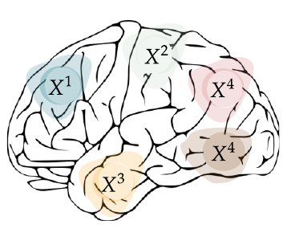{width=100%}
:::
:::

---

## Score-based (Diffusion) Estimation of O-Information

- Total Correlation (TC) estimation:
$$T(X) = \int p_t(x) \left\| \nabla \log p_t(x) - \sum_{i=1}^{N} \nabla \log p_t(x_i) \right\|^2 dx\, dt$$

- Dual Total Correlation (DTC) estimation:
$$D(X) = \int p_t(x) \left\| \nabla \log p_t(x) - \sum_{i=1}^{N} \nabla \log p_t(x_i | x_{\backslash i}) \right\|^2 dx\, dt$$

- With our implementation, all the ingredients are *amortized* within a *single* model.

**Why this matters for organoids**: DeepTracing (2024) uses TC as a regulariser but must rely on a simplified surrogate — a closed-form Gaussian approximation. Our score-based estimator computes TC *exactly* for any distribution, making it directly applicable to the heavy-tailed, zero-inflated distributions of organoid scRNA-seq data at scale.

---

## SOI: Synthetic Benchmark Results

**Quantity**: $\Omega(X_1,\ldots,X_6)$ on two 6-variable Gaussian systems with known ground truth. Variables $X_0$–$X_2$ are coupled redundantly; $X_3$–$X_5$ synergistically. Coupling strength $\rho \in [0.05, 0.9]$.

Also computed: gradient $\partial\Omega/\partial X_i$ — which variables drive the overall redundancy/synergy.

::: {.columns}
::: {.column width="50%"}
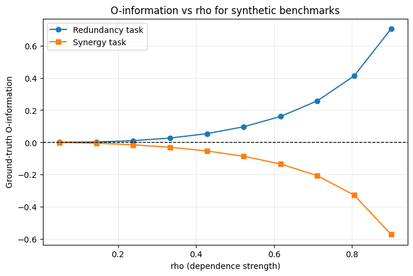{width=100%}
:::
::: {.column width="50%"}
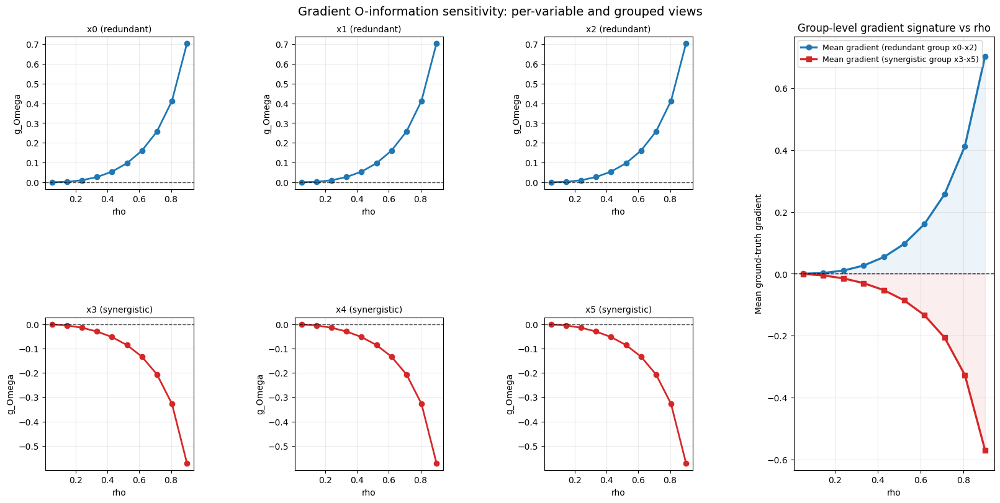{width=100%}
:::
:::

::: {style="font-size:0.85em; color:#444; margin-top:0.3em;"}
The gradient decomposition is the key novel tool: applied to organoid recordings it would tell you *which neurons or areas* drive the collective redundancy vs. synergy — not just whether it exists.
:::

---

## Example: Analysis of Mice Brain Activity

::: {.columns}
::: {.column width="60%"}
**Quantity**: $\Omega(X_1,\ldots,X_6)$ where each $X_i \in \mathbb{R}^5$ is the population response of one of 6 visual cortex areas recorded simultaneously via **Neuropixels** probes.

**Areas**: VISp (V1), VISl, VISal, VISrl, VISam, VISpm — 5 neurons × 6 areas = 30-dimensional joint response. Two conditions × 5 time bins after stimulus onset = 10 models.

::: {.bio-conclusion}
- **Novel stimulus ("change")** → $\Omega > 0$ (redundancy): the joint response is statistically consistent with each area independently carrying overlapping information — one interpretation is redundant broadcast for reliability
- **Repeated stimulus ("non-change")** → $\Omega < 0$ (synergy): the joint response is statistically consistent with a shared code that no single area fully carries — one interpretation is efficient joint coding emerging with familiarity
:::

**What this unlocks**: no previous estimator could compute O-information on 30-dimensional neural data. The score-based approach handles arbitrary distributions, revealing the redundancy→synergy transition that linear (Gaussian) estimators miss entirely.

**Organoid relevance**: apply the same analysis to maturing organoid MEA data to find *when* circuits switch from redundant (immature broadcast) to synergistic (mature integrated) coding — a functional maturity biomarker.
:::
::: {.column width="40%"}
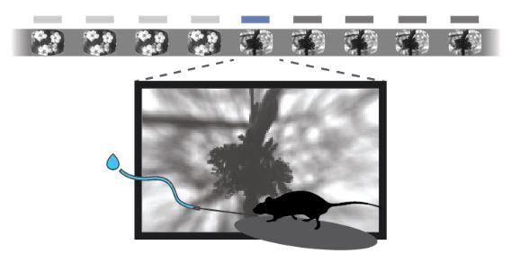{width=80%}
:::
:::

---

## Mice Brain Activity Results

::: {.columns}
::: {.column width="33%"}
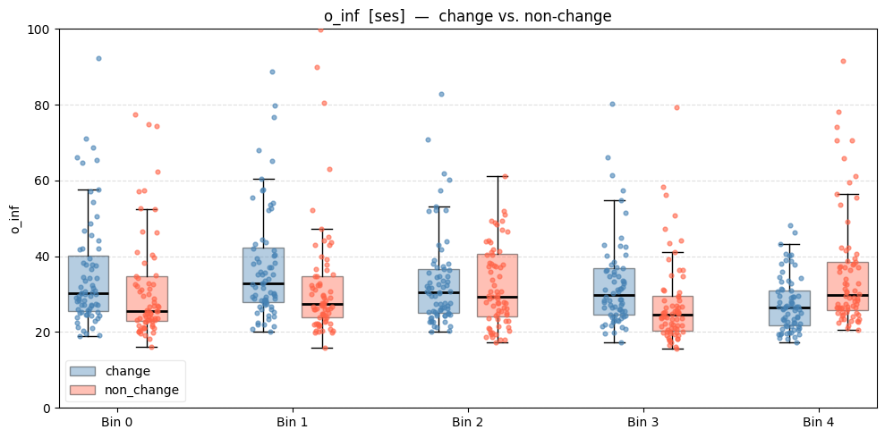{width=100%}
:::
::: {.column width="33%"}
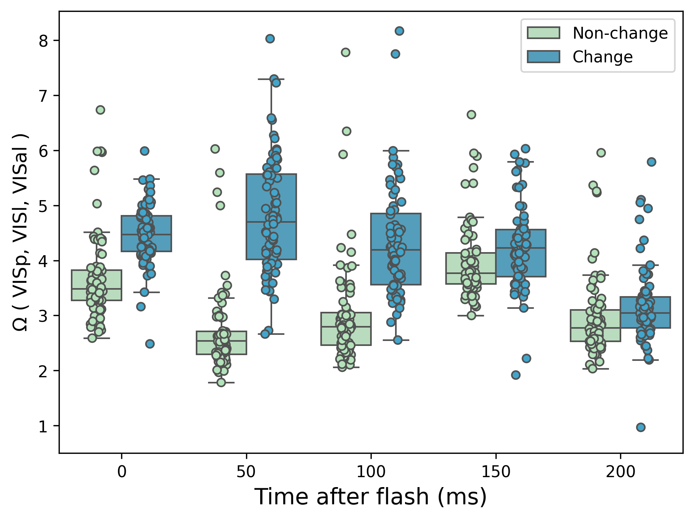{width=100%}
:::
::: {.column width="33%"}
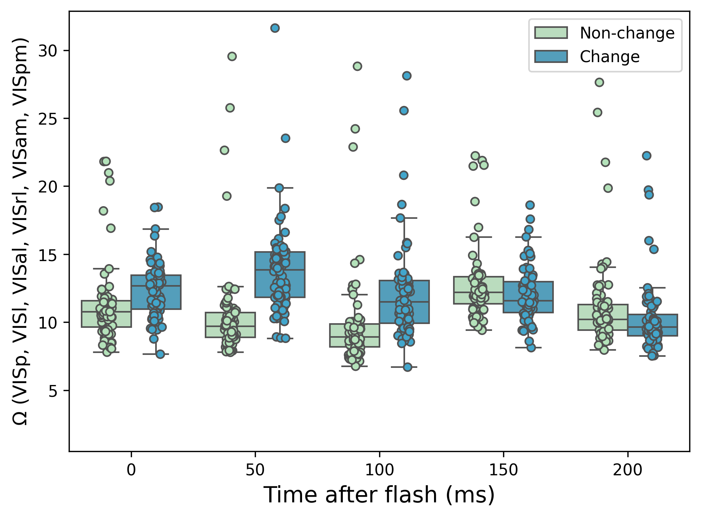{width=100%}
:::
:::

::: {.callout-note appearance="minimal"}
**Key finding**: novel stimuli elicit a statistically redundant response across all visual areas. The effect holds consistently from 3 to 6 areas in this dataset, suggesting it is not a local circuit artifact — though replication across stimulus sets and recording configurations would be needed to establish it as a general property of the visual hierarchy.
:::

---

## Directed Functional Connectivity: Beyond Correlation

::: {.columns}
::: {.column width="60%"}
A core goal in systems neuroscience: determine not just *whether* two brain areas are coupled, but **who drives whom**.

- **Granger causality** (1969): $X$ Granger-causes $Y$ if the past of $X$ helps predict $Y$ beyond $Y$'s own past — widely used but assumes linear, Gaussian dynamics.
- **Transfer Entropy** (Schreiber 2000): the nonlinear, model-free generalisation:
$$\mathrm{TE}_{X\to Y} = I(Y_t;\, \mathbf{X}_{\text{past}} \mid \mathbf{Y}_{\text{past}})$$
  Granger causality is a *special case* of TE under Gaussian assumptions.
- Captures nonlinear, asymmetric information flow — critical for neural circuits where signalling is inherently nonlinear.
:::
::: {.column width="40%"}

V1 &nbsp;⟶&nbsp; V2

$\mathrm{TE}_{V1\to V2} \neq \mathrm{TE}_{V2\to V1}$

Transfer entropy is asymmetric by construction — it captures the <em>direction</em> of information flow, not just its presence.

:::
:::

- *However*: existing TE estimators suffer from the curse of dimensionality, require restrictive distributional assumptions...
- We propose **TENDE** (Transfer Entropy Neural Diffusion Estimation) with Simon Pedro Galeano Munoz and Maurizio Filippone (KAUST)

---

## Emerging Connectivity in Brain Organoids

**Muccitri et al.** (*Cell Reports*, 2024) coupled human iPSC-derived neural organoids to **high-density microelectrode arrays (HD-MEAs)** over 13 weeks of maturation, tracking the emergence of network structure and short-term potentiation — the building blocks of learning and memory.

::: {.columns}
::: {.column width="60%"}
::: {.bio-conclusion}
**Key finding**: **Mutual Information was used** to weight edges in the functional connectivity network — capturing nonlinear statistical dependencies between electrodes, including dependencies that Pearson correlation would miss.
:::

- Network dynamics with scale-free-like properties emerge around week 8–10
- Short-term potentiation-like plasticity develops alongside organised connectivity
- MI-weighted networks successfully distinguished responsive from non-responsive organoid batches

**Transfer Entropy** extends this to directed connectivity:
$$\mathrm{TE}_{i\to j} = I\!\left(X_t^{(j)};\, X_{\text{past}}^{(i)} \;\middle|\; X_{\text{past}}^{(j)}\right)$$
tracking *which electrode drives which* as the circuit matures.

**Uthamacumaran et al. (2024)**: MI-based functional connectivity applied to *aneural* Xenopus morphogenetic tissue — suggesting these tools may extend beyond neural tissues to a wider range of developing biological systems.
:::
::: {.column width="40%"}

<strong>Why standard methods fail here:</strong>  
Granger causality assumes linear, Gaussian dynamics — calcium transients and MEA signals are neither.  
TENDE estimates TE nonparametrically via score matching, handling the nonlinear, heavy-tailed dynamics of organoid electrical activity.

:::
:::

---

## Transfer Entropy: Formulation

- Let $\{X_t\}$ and $\{Y_t\}$ denote discrete time stochastic processes.
- Define:
$$\begin{cases}\begin{aligned}\mathbf{Y}_{t-\ell} &= [Y_{t-1},\,\dots,\,Y_{t-\ell}] \\ \mathbf{X}_{t-k} &= [X_{t-1},\,\dots,\,X_{t-k}]\end{aligned}\end{cases}$$
for some natural numbers $\ell, k$.
- The TE from $\{X_t\}$ to $\{Y_t\}$ is given by:
$$\mathrm{TE}_{X\to Y}(k,\ell) = I\!\left(Y_t;\,\mathbf{X}_{t-k}\mid\mathbf{Y}_{t-\ell}\right)$$
- TE quantifies how much $Y_t$ depends on the past of $\{X_t\}$ once its own past is already known.

---

## Transfer Entropy: Example

::: {.columns}
::: {.column width="50%"}
**Synthetic validation**: coupled OU process with *known* unidirectional coupling ($Y\!\to\!X = 0.5$, $X\!\to\!Y = 0$). Quantity: $\mathrm{TE}_{Y\to X}(k,\ell) = I(X_t;\, Y_{t-k} \mid X_{t-\ell})$. TENDE recovers the correct asymmetry.

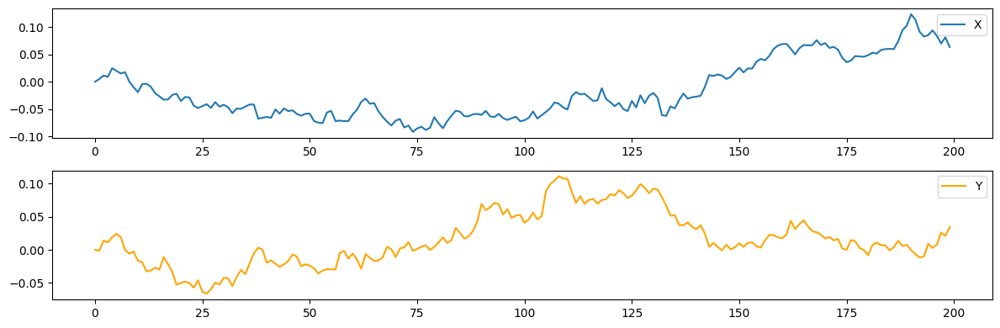{width=100%}
:::
::: {.column width="50%"}
**Real physiological data**: 10-minute recording (~6000 samples at ~10 Hz), z-score standardised.

**Quantity computed**: $\mathrm{TE}_{\text{resp}\to\text{HR}}(k, \ell{=}2)$ and $\mathrm{TE}_{\text{HR}\to\text{resp}}(k, \ell{=}2)$ for $k \in \{2,4,6,8,10\}$ seconds — how much does 2 steps of one signal's history reduce uncertainty about the other's next value, beyond the target's own history?

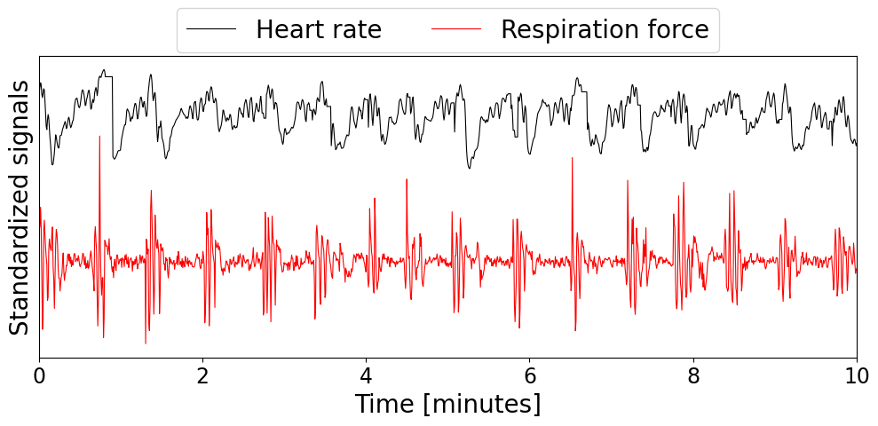{width=100%}
:::
:::

---

## TENDE Results

::: {.columns}
::: {.column width="50%"}
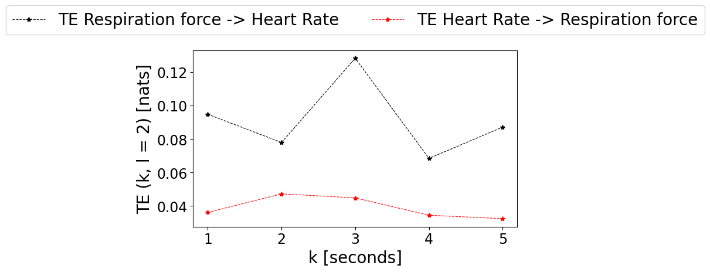{width=100%}
:::
::: {.column width="50%"}
::: {.fragment}
::: {.bio-conclusion}
**What is recovered**: **respiratory sinus arrhythmia (RSA)** — breathing modulates heart rate more than the reverse. Respiration pacemaking in the brainstem dominates cardiac autonomic modulation — a well-characterised physiological coupling that linear Granger causality may underestimate or miss under non-stationary conditions.
:::
:::

::: {.fragment}
**Why previous methods failed**: Granger requires Gaussian residuals; KNN estimators need $O(n^2)$ computation in high dimensions. TENDE — score-based, sample-efficient — gives stable estimates at 6000 samples with 1000 MC iterations.
:::

::: {.fragment}
**Organoid application**: applied to organoid MEA recordings, TENDE quantifies $\mathrm{TE}_{A\to B}$ between any electrode pair — mapping the *causal wiring diagram* of emerging circuits and tracking how it evolves over weeks of maturation.
:::
:::
:::

## Application: Mosaic Brain Organoids

::: {.columns}
::: {.column width="55%"}
**Caporale et al.** (*Nature Methods*, 2024): multiplexing cortical brain organoids from multiple donors enables longitudinal dissection of developmental traits at single-cell resolution.

::: {.bio-conclusion}
Co-cultured clonal lineages may depart from independent single-lineage behaviour — SOI and TENDE would allow us to test whether non-additive interactions shape clonal dynamics in ways that pairwise correlation cannot detect.
:::

**SOI** and **TENDE** apply directly:

- **SOI** — $\Omega(\text{lineage}_1, \ldots, \text{lineage}_N)$: when does clonal co-culture switch from *redundant* (independent expansion) to *synergistic* (non-additive coordination)? The sign change is a quantitative marker of emergent interaction.

- **TENDE** — $\mathrm{TE}_{\text{lineage}_i \to \text{lineage}_j}(k)$: which lineage drives which, and when? Maps the causal structure of clonal dynamics as the mosaic matures.
:::
::: {.column width="45%"}
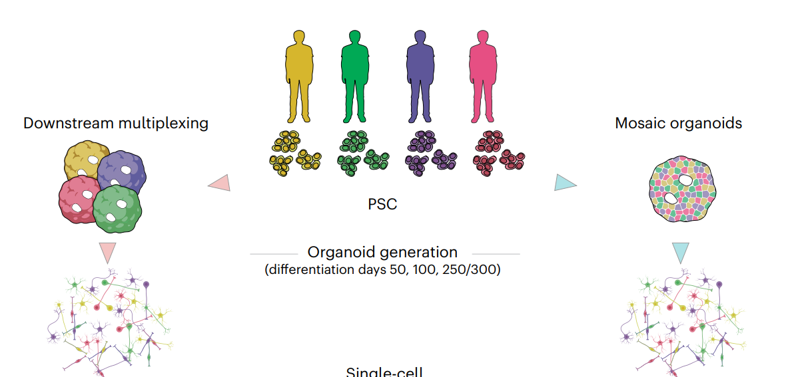{width=100%}
:::
:::

---

# Conclusions

## In Summary

**A unified framework** — score-based diffusion processes — enables scalable, nonparametric estimation of five information metrics that were previously intractable for real biological data:

| Method | What it measures | Key biological result |
|---|---|---|
| MINDE | MI (continuous) | **Foundational building block** — enables INFO-SEDD, DDMEC, SOI, TENDE |
| INFO-SEDD | MI (discrete) | DNA regulatory elements; scRNA-seq GRN inference |
| DDMEC | Max-MI coupling | ATAC-seq / RNA-seq alignment without paired cells |
| SOI | Synergy & redundancy | Redundant→synergistic transition in visual cortex |
| TENDE | Directed information flow | Causal architecture of developing neural circuits |

**The organoid field is already using these metrics** — we provide the scalable estimators:

- Muccitri et al. (2024): MI → organoid functional connectomes from HD-MEA
- Weinreb et al. (2020): MI between sister cells → hidden fate determinants
- DeepTracing (2024): Total Correlation → disentangling lineage from cell state
- Clonotrace (2025): MI → joint lineage + transcriptomic analysis

**Going deeper** (backup slides available):

- Formal measure-theoretic derivations and proof sketches
- Convergence analysis: sample complexity, model capacity requirements
- Extended numerical validation across additional benchmark families
- Thermodynamic integration / Feynman-Kac alternative derivation

---

## Try It Yourself

All results shown in this talk were produced by Colab notebooks — **runnable in your browser, no installation required**.

::: {.columns}
::: {.column width="50%"}
**Available notebooks:**

| Method | What you can run |
|---|---|
| **INFO-SEDD** | TATA-box discovery on *Arabidopsis* promoters |
| **SOI** | Synthetic redundancy/synergy benchmarks |
| **SOI** | VBN visual cortex O-information |
| **TENDE** | TE on coupled OU + heart rate/respiration |

All notebooks load pretrained checkpoints — results in minutes, not hours.
:::
::: {.column width="50%"}
**Repository**: [github.com/giuliofranzese/Cajal](https://github.com/giuliofranzese/Cajal)

::: {.callout-tip appearance="minimal"}
The same notebooks can serve as **templates** for your own data:
substitute the data-loading cell, adjust dimensions, run. The estimators make no assumption about your distribution.
:::

*Questions, issues, collaborations: [giulio.franzese@eurecom.fr](mailto:giulio.franzese@eurecom.fr)*
:::
:::

---

## References

1. Franzese et al, *Mutual Information Neural Diffusion Estimation*, ICLR 2024
2. Bounoua et al, *S$\Omega$I: Score-based O-Information Estimation*, ICML 2024
3. Wang et al, *Information Theoretic Text-to-Image Alignment*, ICLR 2025
4. Wang et al, *RFMI: Estimating Mutual Information on Rectified Flow for Text-to-Image Alignment*, ICLR (Workshop) 2025
5. Foresti et al, *INFO-SEDD: Continuous Time Markov Chains as Scalable Information Metrics Estimators*, ICLR (Workshop) 2025
6. Bounoua et al, *Learning to Match Unpaired Data with Minimum Entropy Coupling*, ICML 2025
7. Franzese et al, *Continuous Time Functional Diffusion Processes*, NeurIPS 2024
8. Franzese et al, *Generative diffusion models in infinite dimensions: a survey*, Philosophical Transactions A 2025
9. Munoz et al, *TENDE: Transfer Entropy Neural Diffusion Estimation*, arXiv preprint

**Organoid & biology literature:**

10. Muccitri et al, *Human neural organoid microphysiological systems show the building blocks necessary for basic learning and memory*, Cell Reports 2024
11. Weinreb et al, *Lineage tracing on transcriptional landscapes links state to fate during differentiation*, Science 2020
12. Teschendorff et al, *Single-cell entropy for quantifying differentiation potency (SCENT)*, Nature Protocols 2017/2021
13. Uthamacumaran et al, *Revealing non-trivial information structures in aneural biological tissues via functional connectivity*, 2024
14. DeepTracing: *A deep generative framework for disentangling intrinsic states from lineage constraints*, 2024/2025
15. Clonotrace: *A framework for integrating lineage and transcriptomic information*, 2024/2025

# Backup

## An Informal Introduction

::: {style="font-size: 2em; text-align: center; margin-top: 2em;"}
An **informal** introduction
:::

---

## Probability Spaces

- A probability space $(\Omega, \mathcal{F}, \mathrm{P})$ consists of:
  - $\Omega$: The sample space (set of all possible outcomes).
  - $\mathcal{F}$: A $\sigma$-algebra, a collection of subsets of $\Omega$ representing events.
  - $\mathrm{P}$: A probability measure that assigns a number between 0 and 1 to each event in $\mathcal{F}$.

---

## Understanding $\sigma$-Algebra in Simple Terms

- A $\sigma$-algebra can be understood as defining the **granularity** of information available.
- It must satisfy:
  - The whole sample space $\Omega$ is included.
  - If an event is in $\mathcal{F}$, its complement must also be in $\mathcal{F}$.
  - If a countable sequence of events is in $\mathcal{F}$, their union must also be in $\mathcal{F}$.
- Example: Rolling a dice.
  - $\Omega = \{1,2,3,4,5,6\}$.
  - A possible $\sigma$-algebra: $\{\emptyset, \Omega, \{1,3,5\}, \{2,4,6\}\}$ (representing even and odd outcomes).

---

## Understanding $\sigma$-Algebra (cont.)

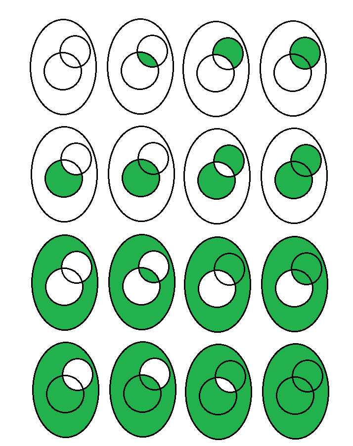{width=50%}

---

## Random Variables as Mappings

- A random variable $X$ is a function that maps outcomes from the sample space $\Omega$ to real numbers:
$$X: \Omega \to \mathbb{R}$$
- Example 1: Rolling a dice. If $\omega\in\Omega=\{1,2,3,4,5,6\}$, then $X(\omega)=\omega$.
- Example 2: Defining an odd/even variable. $Y(\omega)=1$ if $\omega$ is odd, $Y(\omega)=0$ if $\omega$ is even.

---

## Random Variables as Mappings (cont.)

- A random variable must be measurable with respect to a given $\sigma$-algebra to be well-defined.
- Example:
  - With $\sigma$-algebra $\{\emptyset,\Omega,\{1,3,5\},\{2,4,6\}\}$, $Y$ (odd/even) is measurable.
  - However, $X$ (exact roll outcome) is not measurable — a **finer** $\sigma$-algebra is needed.
- Intuitive interpretation: **Doob's lemma**: A random variable is measurable with respect to a $\sigma$-algebra if and only if there exists a function that depends only on elements of the algebra.

---

## Introduction to Stochastic Processes

- A stochastic process is a collection of random variables indexed by time:
$$Y_t: \Omega \to \mathbb{R}, \quad t \geq 0$$
- It describes how a system evolves randomly over time.
- Examples:
  - Stock prices.
  - Population dynamics.
  - Temperature variations.

---

## Filtration and Adapted Processes

- A filtration is a sequence of $\sigma$-algebras representing growing information over time:
$$\mathcal{F}_0 \subseteq \mathcal{F}_1 \subseteq \mathcal{F}_2 \subseteq \dots$$
- Intuitively, it models the **accumulation of knowledge** as time progresses.
- A process is *adapted* if at each time instant it is measurable with respect to the filtration.

---

## Probability Measure

(**Informal, not complete**) In the framework of measure theory, a probability measure $\mu$ is a mapping from **subsets** $\{S_i\}_i$ of a given sample space $\Omega$ such that:

- It is positive: $\mu(S_i)\geq 0$
- For disjoint sets $S_i,S_j$ ($S_i\cap S_j=\emptyset$) it holds $\mu(S_i\cup S_j)=\mu(S_i)+\mu(S_j)$.
- Its "integral" is equal to one: $\mu(\Omega)=1$.

Familiar examples:

- $\Omega=\mathbb{R}$, Gaussian probability $\mu(dx)=p(x)dx=\frac{1}{\sqrt{2\pi}}\exp(-\frac{x^2}{2})dx$
- $\Omega=\{0,1\}$, Bernoulli RV $\mu(\{0\})=\mu(\{1\})=\frac{1}{2}$

---

## Definition of SDEs

- A stochastic differential equation (SDE) is a particular class of stochastic processes.
- A general diffusion process on a probability space $(\Omega,\mathcal{F},\mathrm{P})$ is given by:
$$Y_t(\omega) = Y_0(\omega) + \int_0^t H(Y_s(\omega),t)\,ds + W_t(\omega)$$
where:
  - $Y_t$ is the stochastic process.
  - $H(Y_t(\omega),t)$ is the drift term.
  - $W_t$ is a Brownian motion, representing Gaussian noise.
- It only makes sense when considered with respect to a **filtration** $(\mathcal{F}_t)_{t\geq 0}$, representing the available information over time.

---

## Formal MINDE Derivation

- Consider a probability space $(\Omega,\mathcal{F},\mathbb{P})$, together with a growing filtration $\mathcal{F}_t$
- Consider a generic random variable $A$ ($\mathcal{F}_0$-measurable) with probability measure $\mu^A(dx)$
- Build a simple SDE in $[0,T]$ with initial conditions $\sim\mu^A$:
$$\begin{cases}\dd X_t=-X_t\,\dd t+\sqrt{2}\,\dd W_t,\\X_0=A\sim\mu^A\end{cases}$$
where $W_t$ is an $\mathcal{F}_t$ Brownian motion.
- This SDE corresponds to a path measure $\mathbb{P}^{A}$.
- Two SDEs which differ only by initial conditions have KL divergence:
$$\KL{\mathbb{P}^{\mu^A}}{\mathbb{P}^{\mu^B}}=\E_{\mathbb{P}^{\mu^A}}\!\left[\log\frac{d\mathbb{P}^{\mu^A}}{d\mathbb{P}^{\mu^B}}\right]=\KL{\mu^A}{\mu^B}$$

---

## Formal MINDE Derivation (cont.)

**Time-reversal** $\hat{X}_t\defeq X_{T-t}$:

- KL is invariant to time-reversal: $\KL{\mathbb{P}^{\mu^A}}{\mathbb{P}^{\mu^B}}=\KL{\hat{\mathbb{P}}^{\mu^A}}{\hat{\mathbb{P}}^{\mu^B}}$
- Time reversal of SDE is again an SDE [Léonard 2014]
- Score function $\leftrightarrow$ Denoiser (same as before)

**Girsanov theorem**:

$$\KL{\hat{\mathbb{P}}^{\mu^A}}{\hat{\mathbb{P}}^{\mu^B}}\simeq \E_{\mathbb{P}^{\mu^A}}\!\left[\int_0^T\norm{\nabla\log p^{A}_t(X_t)-\nabla\log p^{B}_t(X_t)}^2\dd t\right]$$

- Combining with time-reversal invariance → KL-estimator!
- Initial conditions $\KL{\mu^A_T}{\mu^B_T}$ should be negligible (Bakry-Emery condition / ergodicity [Collet, Malrieu 2008])

---

## Experimental Results

MINDE variants:

- Consistently outperform all competitors on standard benchmarks.
- Are capable of accurately estimating MI in the challenging High MI benchmarks:

::: {.columns}
::: {.column width="30%"}
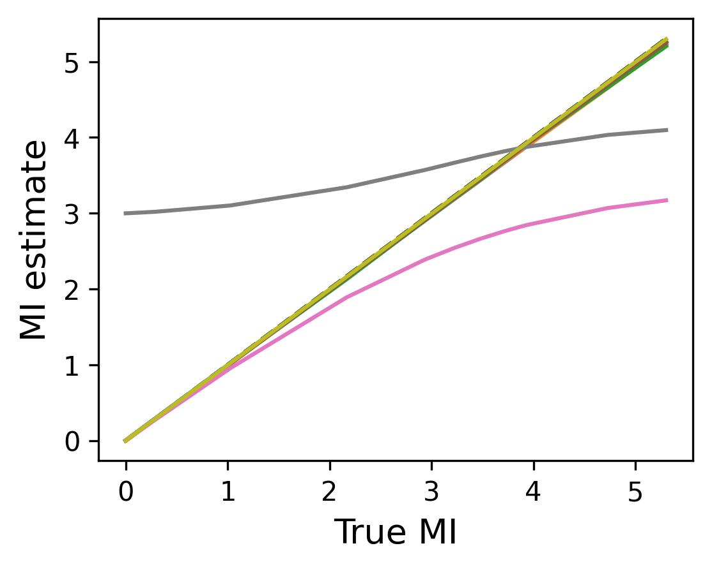{width=100%}
:::
::: {.column width="30%"}
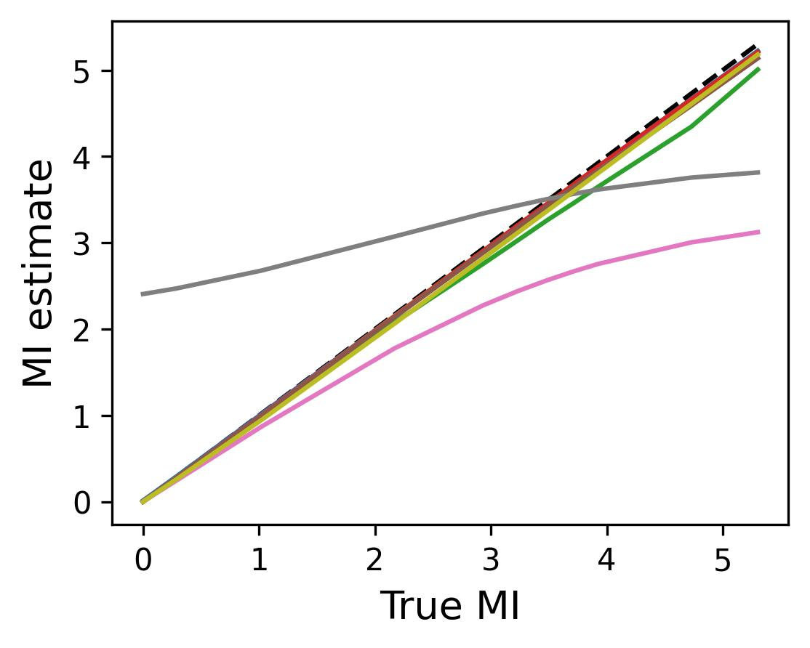{width=100%}
:::
::: {.column width="30%"}
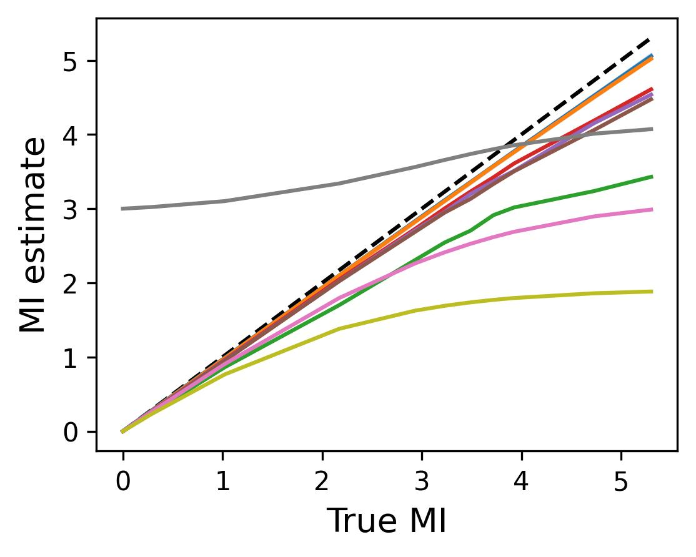{width=100%}
:::
:::

---

## Experimental Results (cont.)

Pass the self-consistency tests:

::: {.columns}
::: {.column width="33%"}
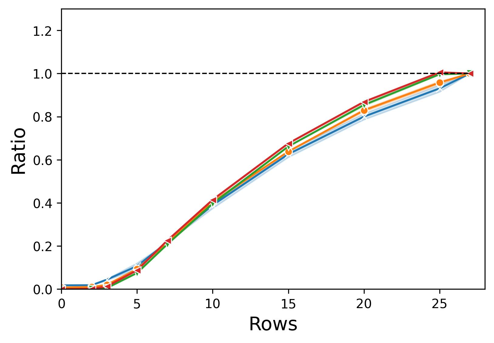{width=100%}
:::
::: {.column width="33%"}
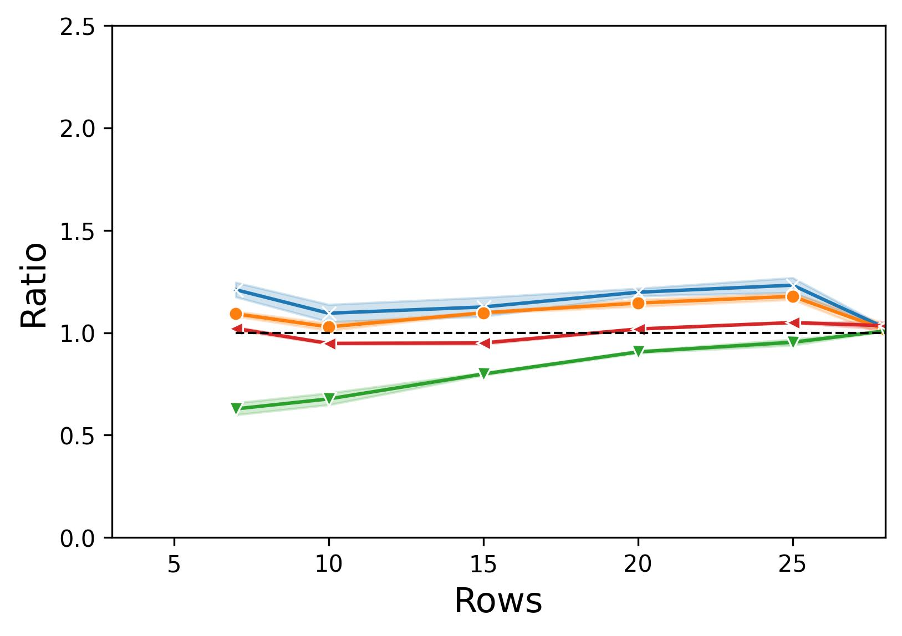{width=100%}
:::
::: {.column width="33%"}
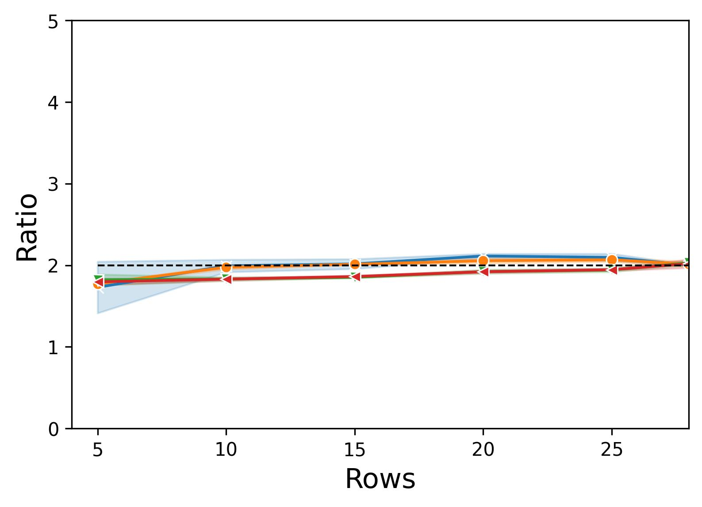{width=100%}
:::
:::

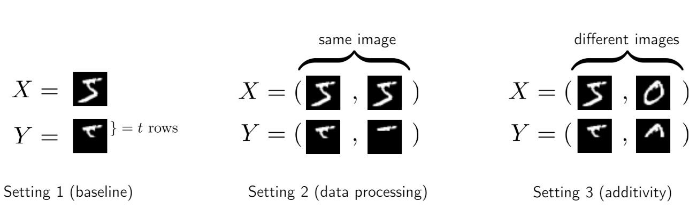{width=100%}

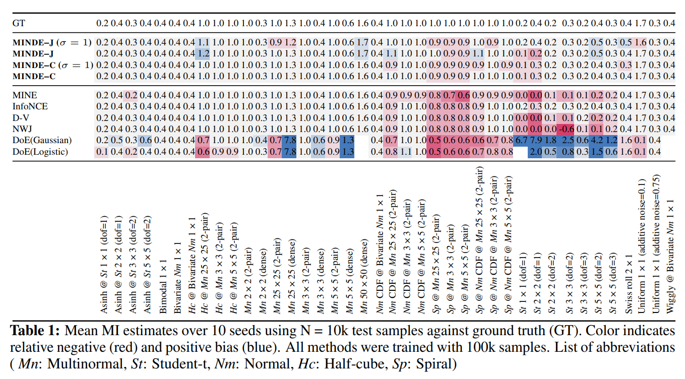{width=60%}
