# Introduction

## Trajectory Inference in Single-Cell Genomics

:::: {.columns}
::: {.column width="50%"}
- **Goal:** Reconstruct dynamical processes of cellular development.
- **Observations:** Snapshots — independent samples from time-indexed marginals $\mu_{t_1}, \mu_{t_2}, \dots$
- **Destructive measurements:** Individual cells cannot be tracked longitudinally.
:::
::: {.column width="45%"}
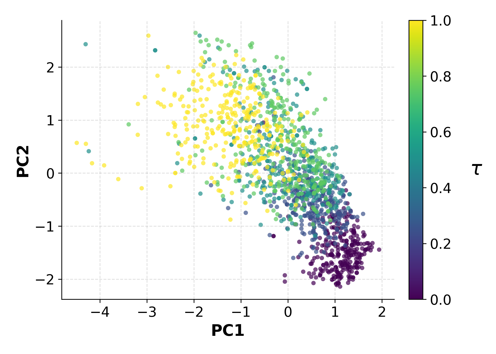{width="100%"}
:::
::::

> **The fundamental challenge:** We observe *where* cells are at each time point, but never *how* individual cells move between them.

---

## Mathematical Formulation

- Let $(\mu_{t_i})_{i=1}^T$ be observed marginals at discrete times $t_1 < \cdots < t_T$
- A **trajectory inference method** outputs a path measure $\nu$ on $\mathcal{H}$ whose time-$t_i$ marginals match the observations
- ODE-based methods (TIGON, AM): deterministic flows
- SDE-based methods (SBIRR, vSB, MSBM): stochastic Schrödinger Bridge-type flows
- Drift-Diffusion methods (MFL): path-space optimization, min-entropy w.r.t. Wiener measure

> **Non-identifiability:** Infinitely many path measures $\nu$ are consistent with any finite set of marginals $\mu_{t_1}, \ldots, \mu_{t_T}$.

---

## The Evaluation Problem

**Standard practice:** evaluate TI methods by marginal reconstruction on held-out snapshots

Common metrics: EMD ($W_1$), $W_2$, SWD, MWD, MMD

**Why this is fundamentally limited:**

1. Marginals do not constrain how states at different times are *coupled*
2. Distinct trajectory models can match marginals while inducing very different path distributions
3. The true object of interest — the path measure $\nu$ — is invisible to marginal-only criteria

$\Rightarrow$ Need a metric that acts **directly on distributions over trajectories**

---

## Finite-Dimensional vs Function Spaces

:::: {.columns}
::: {.column width="48%"}
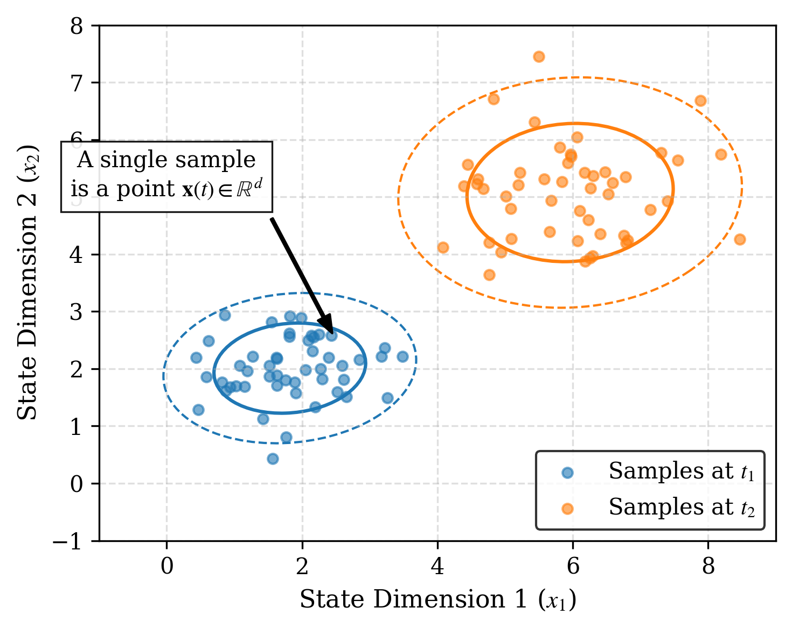{width="100%"}
:::
::: {.column width="4%"}
:::
::: {.column width="48%"}
{width="100%"}
:::
::::

---

## Why Marginal Metrics Fail

Empirical failure modes:

- **Temporal instability:** the same method can rank best at some snapshots and worst at others
- **Metric disagreement:** at a fixed timepoint, EMD, $W_2$, MMD can produce conflicting rankings
- **Kernel saturation:** MMD with fixed bandwidth becomes insensitive to large discrepancies
- **Training marginals bias:** methods matching training marginals may deteriorate at intermediate times

> **Metrics inconsistency:** Marginals are insufficient statistics for path measures. Different metrics lead to different rankings across (or for the same) snapshots.

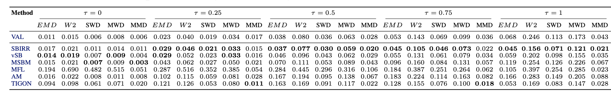{width="85%"}

---

## Motivating Example: Same Marginals, Different Dynamics

:::: {.columns}
::: {.column width="50%"}
**Petal dataset, $\tau = 0.75$:**

- MSBM: $W_2 = 0.160$
- TIGON: $W_2 = 0.155$

**Marginals are nearly identical** — yet the trajectories are qualitatively different!

Only a path-level metric can expose this discrepancy.
:::
::: {.column width="50%"}
{width="95%"}
:::
::::

---

## Our Approach: Overview

> **Key idea:** Treat path measures as *first-class citizens* and estimate KL divergence directly between them.

**Our contributions:**

1. **FKL estimator** — tractable KL divergence between probability measures on function space, via infinite-dimensional flow theory (FFM)

2. **Benchmark** — systematic study showing five widely-used marginal metrics produce inconsistent rankings

3. **Empirical validation** — FKL provides coherent, consistent rankings aligned with visual judgement

# Background

## Hilbert Space Setting

Let $\mathcal{H}$ be a real separable Hilbert space with inner product $\langle \cdot, \cdot \rangle_{\mathcal{H}}$ and countable ONB $\{e_k\}_{k \in \mathbb{N}}$.

For $K \in \mathbb{N}$, define the canonical projection $\pi_K : \mathcal{H} \to \mathbb{R}^K$ by:
$$\pi_K(x) = \bigl(\langle x, e_1 \rangle, \ldots, \langle x, e_K \rangle\bigr)$$

Consider two independent $\mathcal{H}$-valued random variables:

- $X_0 \sim \mu_0 = \mathcal{N}(0, C)$ — Gaussian reference with **trace-class** covariance $C$
- $X_1 \sim \mu_1$ — the data distribution

The **Cameron–Martin space** is represented as $\mathcal{H}_C$.

---

## Functional Flow Matching (FFM)

Construct the **linear interpolation** between $X_0$ and $X_1$:
$$X_t = (1-t) X_0 + t X_1, \quad t \in [0,1], \qquad \mu_t = \mathrm{Law}(X_t)$$

A **velocity field** $v : \mathcal{H} \times [0,1] \to \mathcal{H}$ **generates** the path $(\mu_t)$ via the continuity equation:
$$\int_{\mathcal{H}} \varphi(x,1)\,d\mu_1 - \int_{\mathcal{H}} \varphi(x,0)\,d\mu_0 = \int_0^1 \int_{\mathcal{H}} \bigl(\partial_t \varphi + \langle v_t(x), \nabla_x \varphi \rangle\bigr)\,d\mu_t\,dt$$

**Training:** minimize the tractable conditional flow-matching loss

**Generation:** simulate the learned ODE $\partial_t \phi_t(x) = v_\theta(\phi_t(x), t)$ from $x \sim \mu_0$

---

## KL Divergence on Function Space

**Setup:** two distributions $\nu^A$ and $\nu^B$ on $\mathcal{H}$, sharing Gaussian reference $\mu_0 = \mathcal{N}(0, C)$.

$$\mathrm{KL}(\nu^A \| \nu^B) = \begin{cases} \displaystyle \int_{\mathcal{H}} \log \frac{d\nu^A}{d\nu^B}\,d\nu^A & \text{if } \nu^A \ll \nu^B \\ +\infty & \text{otherwise} \end{cases}$$

**Two assumptions required:**

1. **Assumption 2.1 (Radon–Nikodym):** $\nu^A \ll \nu^B$, and $\frac{d\nu^A}{d\nu^B} \leq M$ $\nu^B$-a.s. for some $M < \infty$
2. **Assumption 2.2 (Cameron–Martin support):** both $\nu^A$ and $\nu^B$ are supported on $\mathcal{H}_C$

---

## Absolute Continuity and KL Divergence

Under Assumptions 2.1–2.2, for $t \in [0,1)$, we assume **absolute continuity** $\mu^A_t \ll \mu^B_t$ with density ratio $r_t(x) := \frac{d\mu^A_t}{d\mu^B_t}(x)$.

> **Lemma 3.4:** Under mild regularity, the KL divergence between path measures is:
> $$\mathrm{KL}(\nu^A \| \nu^B) = \int_0^1 \int_{\mathcal{H}} \langle v_t^A(x) - v_t^B(x), \nabla_x \log r_t(x) \rangle_{\mathcal{H}} \, d\mu_t^A(x) \, dt$$

The **score difference** $\nabla_x \log r_t(x)$ is computed via a reference measure $\rho_t$:
$$\nabla_x \log r_t(x) = \nabla_x \log \frac{d\mu_t^A}{d\rho_t}(x) - \nabla_x \log \frac{d\mu_t^B}{d\rho_t}(x)$$

# Method

## Step 1: Basis Projection

For $K \in \mathbb{N}$, define projected measures $\hat{\mu}^{A,B}_{t,K} = (\hat{\pi}_K)_\# \mu^{A,B}_t$.

The projected density ratio is $r^K_t = \frac{d\hat{\mu}^A_{t,K}}{d\hat{\mu}^B_{t,K}} = \mathbb{E}_{P^B}[r_t \mid \mathcal{G}_K]$, with $\mathcal{G}_K = \sigma(\hat{\pi}^K(X_t))$.

From the **weak continuity equation** with $r^K_0 = 1$ ($P^B$-a.s.):
$$\mathrm{KL}(\nu^A_K \| \nu^B_K) = \int_0^1 \int_{\mathcal{H}} \left(\partial_t \log r^K_t(x) + \langle v^A_t(x), \nabla_x \log r^K_t(x) \rangle \right) d\mu^A_t(x)\,dt$$

---

## Step 2: Combining the Continuity Equations

From the continuity equation:
$$\int_0^1 \int_{\mathcal{H}} \partial_t \log r^K_t(x)\,d\mu^A_t(x)\,dt = -\int_0^1 \int_{\mathcal{H}} \langle v^B_t(x), \nabla_x \log r^K_t(x) \rangle\,d\mu^A_t(x)\,dt$$

Substituting back:
$$\mathrm{KL}(\nu^A_K \| \nu^B_K) = \int_0^1 \int_{\mathcal{H}} \langle v^A_t(x) - v^B_t(x),\, \nabla_x \log r^K_t(x) \rangle\,d\mu^A_t(x)\,dt$$

Note that $\mathrm{KL}(\nu^A_K \| \nu^B_K) \to \mathrm{KL}(\nu^A \| \nu^B)$ as $K \to \infty$.

---

## Step 3: Expressing the Log-Gradient via Velocity

The logarithmic gradients can be expressed as:
$$\nabla_x \log \frac{d\mu^{A,B}_t}{d\rho_t}(x) = \frac{t}{(1-t)^2} C^{-1} \mathbb{E}_{P^{A,B}}[X_1 \mid X_t = x]$$

For the linear interpolation used in FFM:
$$v^{A,B}_t(x) = \frac{1}{1-t}\mathbb{E}_{P^{A,B}}[X_1 \mid X_t = x] - \frac{x}{1-t}$$

$\Rightarrow$ The log-gradient of $r_t = \frac{d\mu^A_t}{d\mu^B_t}$ can be expressed entirely in terms of $v^A_t - v^B_t$.

---

## The FKL Formula

$$\boxed{\mathrm{KL}(\nu^A \| \nu^B) = \int_0^1 \int_{\mathcal{H}} \frac{t}{1-t} \left\| v^A_t(x) - v^B_t(x) \right\|^2_{\mathcal{H}_{\mu_0}} d\mu^A_t(x)\,dt}$$

> **Interpretation:** KL divergence between two trajectory distributions is quantified by the difference in their velocity fields, integrated over time and over $\mu^A_t$.

- The weight $\frac{t}{1-t}$ increases toward $t=1$: discrepancies at later times are penalized more
- The norm is in $\mathcal{H}_{\mu_0}$ — the covariance operator $C$ regularizes the comparison

---

## Estimation Algorithm

**Step 1 — Train a velocity field network, conditioning on the class:**

Given trajectory samples from $\nu^A$ and $\nu^B$, train $v^A_\theta$ and $v^B_\theta$ with a class-conditional FFM loss.

**Step 2 — Monte Carlo estimation of FKL:**

1. Sample $x^A_1 \sim \nu^A$, $\; t \sim \mathcal{U}[0,1]$, $\; x_0 \sim \mathcal{N}(0, C)$
2. Construct interpolation: $x^A_t = t\, x^A_1 + (1-t)\, x_0 \;\sim\; \mu^A_t$
3. Evaluate both velocity fields at $(x^A_t, t)$
4. Compute $\frac{t}{1-t} \| v^A_\theta(x^A_t) - v^B_\theta(x^A_t) \|^2_{C^{1/2}}$
5. Average over samples $\Rightarrow$ FKL estimate

**No ODE integration required** — cost proportional to a single forward pass through two networks.

---

## Implementation Details

**Architecture:** Mesh-Informed Neural Operator (MINO) — transformer version

**Projection:** all computations use $K$-mode truncation of the ONB $\{e_k\}$

**Noise:** **trace-class** noise (Matérn or rougher data covariance) rather than white noise

- Better generation quality and more robust KL estimation
- Resolution invariant

**Asymmetry:** both $\mathrm{KL}(\nu^A \| \nu^B)$ and $\mathrm{KL}(\nu^B \| \nu^A)$ are reported:

- Forward KL: penalizes missing coverage of the reference
- Reverse KL: penalizes hallucinated mass outside the reference support

# Empirical Validation

## Special Case 1: Gaussian Measures

Consider $\nu^A = \mathcal{N}(m^A, R)$ and $\nu^B = \mathcal{N}(m^B, R)$ on $\mathcal{H} = L^2(\mathbb{T}; \mathbb{R})$ with Matérn covariance $R$.

**Closed-form KL:**
$$\mathrm{KL}(\nu^A \| \nu^B) = \frac{1}{2}\|m^A - m^B\|^2_{\mathcal{H}_R}$$

Setting $m^A = \cos(2\pi x)$, $m^B = 0$; ONB $\{e_k(x) = e^{2\pi i k \cdot x}\}$ with $\mathcal{K}e_k = \lambda_k e_k$, $\lambda_k = \sigma^2(4\pi^2 k^2 + \tau^2)^{-\alpha}$.

> **Validation:** FKL estimator closely matches the closed-form value, and is resolution invariant.

---

## Special Case 1: Results

:::: {.columns}
::: {.column width="65%"}

| Case | $D$ | $f$ | $s$ | Fwd Analytic | Fwd Estim. | Rev Analytic | Rev Estim. |
|------|-----|-----|-----|-------------|-----------|-------------|-----------|
| 1 | 1 | 1 | 0.5 | 3.64 | 3.95 | 3.64 | 3.88 |
| 2 | 1 | 1 | 1.5 | 32.79 | 32.61 | 32.79 | 33.31 |
| 3 | 1 | 3 | 1.5 | 50.00 | 49.58 | 50.00 | 49.00 |
| 4 | 1 | 5 | 1.5 | 103.74 | 104.46 | 103.74 | 100.58 |
| 5 | 2 | 1 | 0.5 | 7.29 | 6.77 | 7.29 | 6.72 |
| 6 | 3 | 1 | 0.5 | 10.93 | 10.48 | 10.93 | 10.49 |
| 7 | 5 | 1 | 0.5 | 18.22 | 22.32 | 18.22 | 22.28 |
| 8 | 10 | 1 | 0.5 | 36.43 | 45.12 | 36.43 | 45.73 |

*Gaussian Measure: analytic vs estimated functional KL.*
:::
::: {.column width="35%"}
{width="100%"}
:::
::::

---

## Special Case 2: Linear SDEs (Girsanov)

Two SDEs with same diffusion, different drifts:
$$A: dY_t = c^A Y_t\,dt + g\,dW_t, \qquad B: dY_t = c^B Y_t\,dt + g\,dW_t$$

**Girsanov's theorem + Itô isometry** give the closed-form KL:
$$\mathrm{KL}(\nu^A \| \nu^B) = \frac{(c^A - c^B)^2}{2g^2} \left[ (M_0 + S_0)\,\frac{e^{2c^A} - 1}{2c^A} + \frac{g^2 D}{2c^A}\!\left(\frac{e^{2c^A} - 1}{2c^A} - 1\right) \right]$$

where $M_0 = \|Y_0\|^2$, $S_0 = \text{Tr}(\Sigma_0)$.

Our FKL estimates match this ground truth closely across all tested settings.

---

## Special Case 2: Results

:::: {.columns}
::: {.column width="70%"}

| Case | $D$ | $c_A$ | $c_B$ | $g$ | Fwd Analytic | Fwd Estim. | Rev Analytic | Rev Estim. |
|------|-----|--------|--------|-----|-------------|-----------|-------------|-----------|
| 1 | 1 | 0.01 | 1.50 | 0.75 | 8.93 | 8.87 | 54.71 | 53.77 |
| 2 | 1 | 0.10 | 2.00 | 0.75 | 15.89 | 13.89 | 186.19 | 200.64 |
| 3 | 2 | 0.01 | 1.50 | 0.75 | 17.86 | 18.05 | 109.43 | 127.67 |
| 4 | 3 | 0.01 | 1.50 | 0.75 | 26.79 | 34.58 | 164.14 | 145.06 |
| 5 | 5 | 0.01 | 1.50 | 1.00 | 26.34 | 32.82 | 158.22 | 135.28 |

*Linear SDE: analytic (Girsanov) vs estimated FKL.*
:::
::: {.column width="30%"}
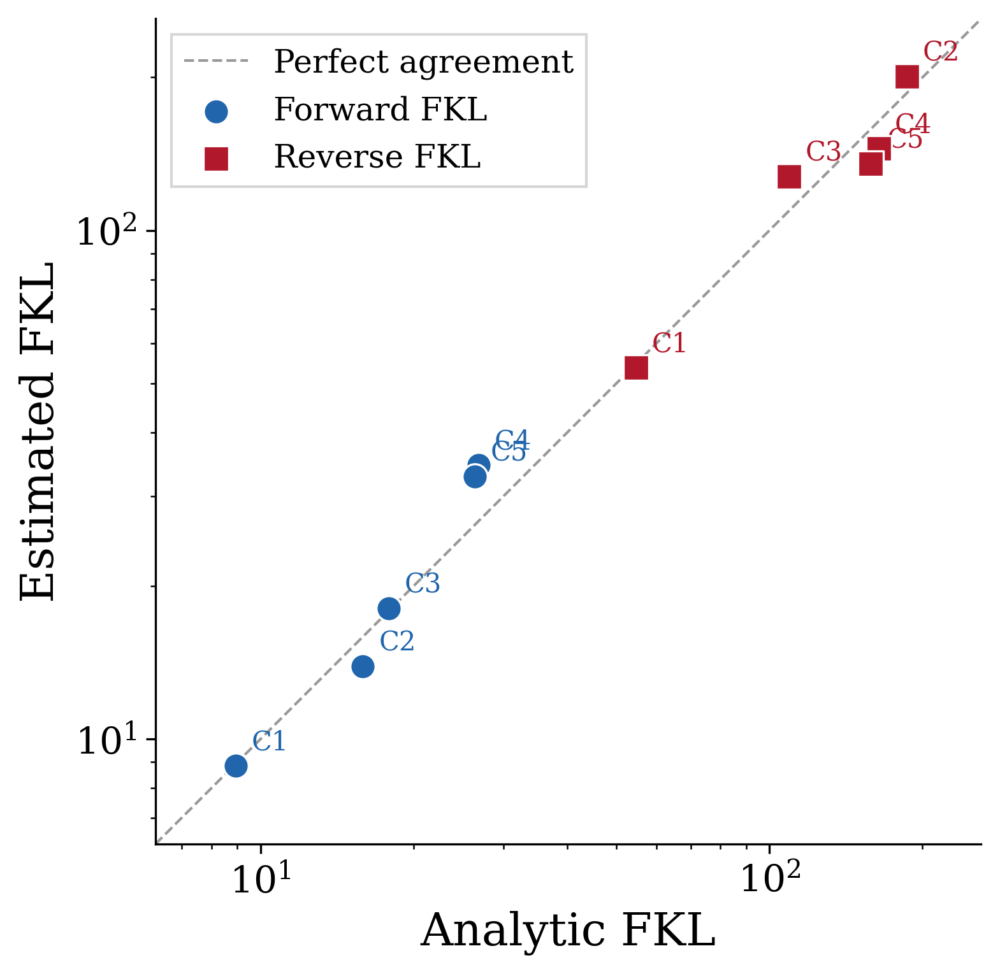{width="100%"}
:::
::::

---

## FKL vs Upsampling Ratio

:::: {.columns}
::: {.column width="50%"}
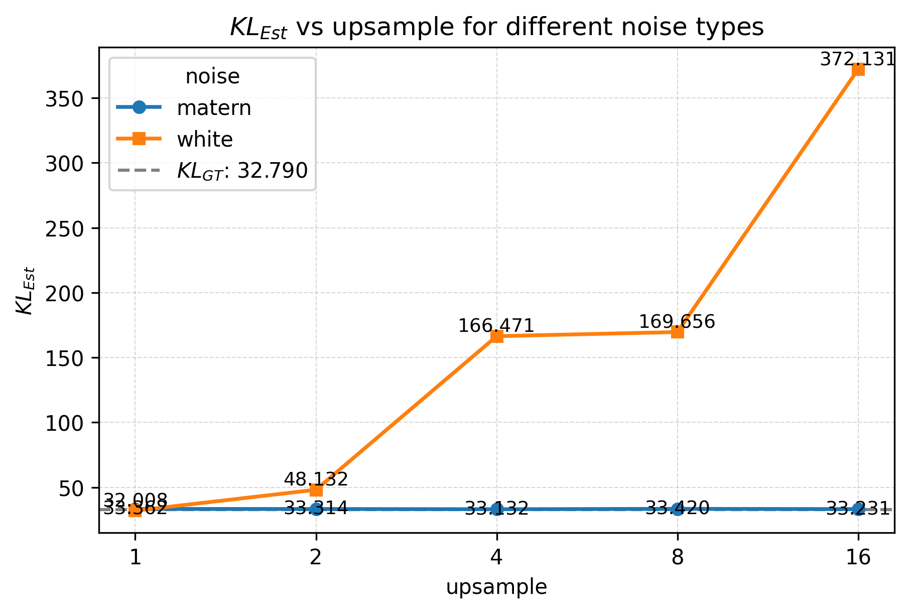{width="100%"}
:::
::: {.column width="50%"}
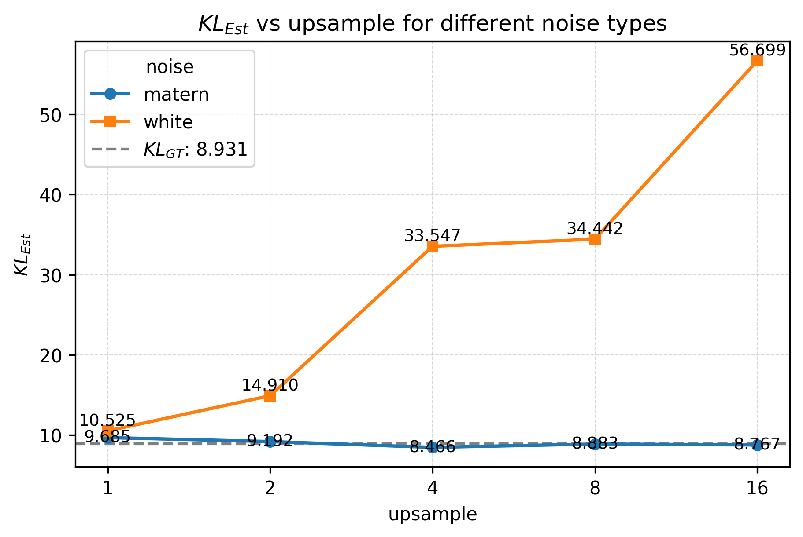{width="100%"}
:::
::::

- **Trace-class noise:** stable KL estimates at all resolutions
- **White noise:** degrades at super-resolution — trace-class noise covariance is essential

# Experiments

## TI Methods Compared

| Method | Paradigm | Key property |
|--------|----------|-------------|
| SBIRR | Schrödinger Bridge | Gradient fields + stochasticity; iterative ref. refinement |
| vSB | Schrödinger Bridge | Vanilla IPF-based; snapshot matching |
| MSBM | Multi-marginal SB | Iterative Markovian Fitting; multi-snapshot constraints |
| MFL | Mean-Field Langevin | Path-space optimization; min-entropy w.r.t. Wiener measure |
| AM | Action Matching | Minimizes kinetic energy; optional entropic variant |
| TIGON | ODE-based | Neural ODE; dynamic unbalanced OT + growth |

Reference: **VAL** = resampled ground-truth trajectories (oracle upper bound)

---

## Marginal Metrics Evaluated

| Metric | Acronym | Type | Property |
|--------|---------|------|----------|
| Earth Mover's Distance | EMD ($W_1$) | OT | Geometry-aware |
| 2-Wasserstein Distance | $W_2$ | OT | Quadratic cost |
| Sliced Wasserstein Distance | SWD | OT | Random projections |
| Max-sliced Wasserstein | MWD | OT | Max-sliced variant |
| Maximum Mean Discrepancy | MMD | Kernel | RBF kernel; bandwidth-dependent |

$$W_p(\mu,\nu) = \left(\inf_{\gamma\in\Pi(\mu,\nu)}\int \|x-y\|^p\,d\gamma\right)^{1/p}$$
$$\mathrm{MMD}^2(\mu,\nu) = \mathbb{E}_{x,x'\sim\mu}[k(x,x')] - 2\,\mathbb{E}_{x\sim\mu,y\sim\nu}[k(x,y)] + \mathbb{E}_{y,y'\sim\nu}[k(y,y')]$$

> **Limitation:** All these metrics operate on marginals — blind to temporal coupling structure.

---

## Synthetic Datasets

:::: {.columns}
::: {.column width="33%"}
**Lotka–Volterra**

- Predator-prey SDE dynamics
- 9 snapshots (5 train, 4 val)
- 100 samples/snapshot
- Non-linear oscillatory behavior
:::
::: {.column width="33%"}
**Repressilator**

- 3-gene regulatory oscillator
- Cyclic inhibition loop
- 11 snapshots (6 train, 5 val)
- 100 samples/snapshot
:::
::: {.column width="33%"}
**Petal**

- Bifurcations & merges
- Mimics cell differentiation
- 5 snapshots (all training)
- 500 samples/snapshot
:::
::::

**Ground-truth trajectories available** $\Rightarrow$ FKL computed against true path measure

---

## Real Single-Cell RNA-seq Datasets

:::: {.columns}
::: {.column width="50%"}
**Embryoid Body (EB)**

- Moon et al., 2019
- 3 training + 2 validation timepoints
- 300 cells per snapshot
- 5 dimensions (PCA-reduced)
- Stem cell differentiation
:::
::: {.column width="50%"}
**Human Embryonic Stem Cell (hESC)**

- Chu et al., 2016
- 3 training + 2 validation snapshots
- 92 / 66 / 138 cells (train)
- 102 / 172 cells (validation)
- 5 dimensions (PCA-reduced)
:::
::::

> **No ground-truth trajectories on real data.** We use **SBIRR** as reference: it models differentiation via gradient fields with stochasticity, matching biological intuition of Waddington's landscape.

# Results: Marginal Metrics

## Synthetic Data, Trajectory Visualizations

::: {#fig-trajectories}
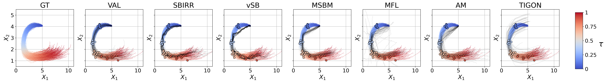{width="85%"}

{width="85%"}

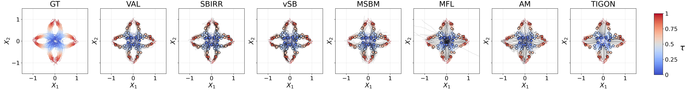{width="85%"}

**Trajectory Inference Results.** Top: Lotka–Volterra. Middle: Repressilator. Bottom: Petal. Colored curves: GT; black curves: generated; scattered points: validation snapshots.
:::

---

## Critical Difference Analysis

:::: {.columns}
::: {.column width="57%"}
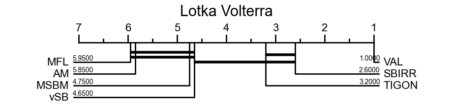{width="92%"}

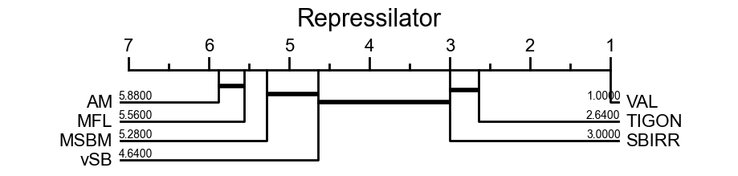{width="92%"}

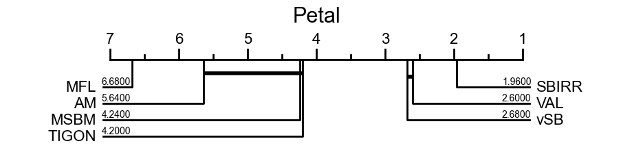{width="92%"}
:::
::: {.column width="41%"}
CD analysis ranks marginal-metric methods by significance:

- **LV & Repr:** methods largely tied — rankings **not significant**
- **Petal:** CD ranks MSBM between *worst* methods; FKL ranks it **best**
- **Agreement:** VAL best overall; SBIRR near top

> In general, marginal metrics are not significant. FKL provides principled ranking even when CD gives weak guidance.
:::
::::

---

## Non-Identifiability: The Core Issue

:::: {.columns}
::: {.column width="45%"}
{width="100%"}
:::
::: {.column width="55%"}
**The non-identifiability principle:**

Any finite set of marginals is consistent with *infinitely many* path measures.

Methods that connect point clouds (TIGON) can score well on marginals while generating unrealistic temporal behavior.

SB methods (vSB, MSBM) focus on snapshot matching and provide limited control over intermediate dynamics unless additional structure is imposed (as in SBIRR).

**Only FKL can distinguish them.**
:::
::::

---

## Limitations of Marginal Metrics

- **Inconsistent rankings:** snapshot-based criteria produce contradictory orderings across datasets
- **Favor wrong models:** methods may score well on marginals while generating dynamics inconsistent with the true process
- **Non-identifiability:** any finite set of marginals is consistent with infinitely many path measures — marginals cannot discriminate between trajectory models
- **CD confirms:** even statistical testing of marginal-metric rankings yields largely non-significant results (LV, Repressilator) or actively misleading ones (Petal)

# Results: FKL Rankings

## FKL: Rankings Across Datasets

| Method | LV Fwd | LV Rev | Repr Fwd | Repr Rev | Petal Fwd | Petal Rev |
|--------|--------|--------|----------|----------|-----------|-----------|
| VAL | 7.85 ± 0.43 | 7.82 ± 0.41 | 5.21 ± 0.08 | 5.19 ± 0.08 | 4.00 ± 0.04 | 3.88 ± 0.05 |
| **SBIRR** | **30.6 ± 0.3** | **32.5 ± 0.7** | **13.4 ± 0.3** | **16.1 ± 0.3** | 21.5 ± 0.2 | 34.3 ± 0.6 |
| vSB | 89.8 ± 2.5 | 87.4 ± 2.4 | 31.2 ± 0.6 | 31.4 ± 0.6 | 24.0 ± 0.3 | 37.1 ± 0.8 |
| **MSBM** | 56.5 ± 2.8 | 37.3 ± 1.0 | 30.5 ± 0.7 | 19.8 ± 0.2 | **13.6 ± 0.1** | **16.1 ± 0.2** |
| MFL | 38.7 ± 0.7 | 153.4 ± 9.9 | 26.4 ± 0.5 | 35.8 ± 0.5 | 42.3 ± 1.1 | 81.5 ± 5.6 |
| AM | 35.2 ± 0.7 | 49.1 ± 1.6 | 27.4 ± 0.4 | 435.8 ± 17.4 | 16.9 ± 0.4 | 32.7 ± 0.9 |
| TIGON | 66.6 ± 3.1 | 51.3 ± 0.8 | 18.8 ± 0.3 | 17.0 ± 0.1 | 40.0 ± 3.1 | 17.8 ± 0.3 |

- **SBIRR** ranks best on LV & Repressilator; **MSBM** best on Petal — consistent with visual inspection
- **TIGON** passes through correct snapshot regions but generates a wrong *smooth spiral*; FKL correctly penalizes this
- **AM / Repressilator:** fwd = 27.4, rev = 435.8 → strong hallucination undetected by marginal metrics

---

## Mode Seeking and Mode Coverage

$\mathrm{KL}(\nu^A \| \nu^B)$: penalizes reference support *not covered* by $\nu^B$ $\;\Rightarrow\;$ **mode coverage**

$\mathrm{KL}(\nu^B \| \nu^A)$: penalizes mass that $\nu^B$ places *outside* the reference $\;\Rightarrow\;$ **hallucination**

When $\mathrm{KL}(\nu^B \| \nu^A) \gg \mathrm{KL}(\nu^A \| \nu^B)$, the method generates trajectories unsupported by the reference.

- **AM / Repressilator** — fwd $= 27.4$, rev $= 435.8$: MMD saturates, masking that AM places mass far outside the reference support
- **MFL / Lotka-Volterra** — fwd $= 38.7$, rev $= 153.4$: forward score alone ranks MFL near SBIRR; reverse KL exposes strong hallucination
- **MSBM / Petal** — fwd $= 13.6$, rev $= 16.1$: nearly symmetric; trajectories well-aligned in both directions

---

## Real Data: Trajectory Visualizations

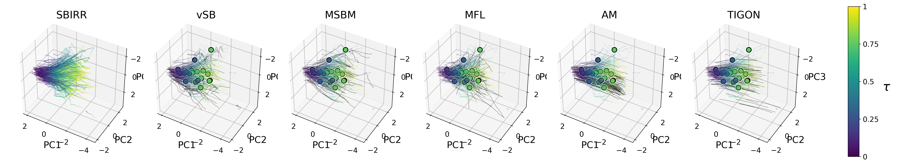{width="100%"}

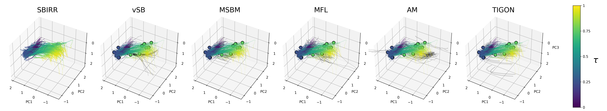{width="100%"}

---

## Real Data Results Summary

**EB dataset** — FKL prefers MFL (fwd) and MSBM (rev); TIGON scores highest on some marginal metrics at $\tau=0.25$ but has FKL = 126, the worst by far.

**hESC dataset** — MFL achieves lowest forward FKL (95.1); TIGON wins most marginal metrics at $\tau=0.25$ but scores FKL = 288.5, the worst.

| Dataset | Method | Marginal Winner? | FKL Best? |
|---------|--------|-----------------|-----------|
| EB | MFL | Partial | ✓ (fwd) |
| EB | TIGON | At $\tau=0.25$ | ✗ (worst) |
| hESC | MFL | No | ✓ (fwd) |
| hESC | TIGON | At $\tau=0.25$ | ✗ (worst) |

- Marginal metrics are inconsistent also in real-data scenarios
- FKL correctly recognizes the difference in underlying dynamics
- FKL consistently prefers SB methods for both datasets, matching biological priors

# Conclusion

## Summary

1. **Problem:** Marginal-based TI evaluation is fundamentally limited by non-identifiability and inconsistency

2. **Theoretical contribution:** FKL — a tractable KL estimator between probability measures on function space:
$$\mathrm{KL}(\nu^A \| \nu^B) = \int_0^1 \int_{\mathcal{H}} \frac{t}{1-t} \|v^A_t(x) - v^B_t(x)\|^2_{\mathcal{H}_{\mu_0}} \,d\mu^A_t\,dt$$

3. **Empirical finding:** Five standard marginal metrics yield inconsistent, often misleading rankings

4. **Take-home message:** FKL provides a coherent evaluation metric aligned with visual inspection and quantifies differences in dynamics between trajectory distributions

---

## Thank You — Questions?

::: {style="text-align:center; font-size:1.8em; font-weight:bold; margin-top:1em;"}
Thank you!
:::

::: {style="text-align:center; margin-top:1.5em;"}
**Paper:** *Relative Entropy Estimation in Function Space: Theory and Applications to Trajectory Inference*

WANG Chao, NEPOTE Luca, FRANZESE Giulio, MICHIARDI Pietro — EURECOM

*Preliminary work under review at ICML.*
:::

## References {.unnumbered}

::: {#refs}
:::
