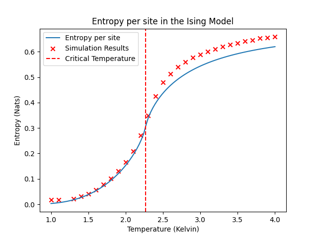
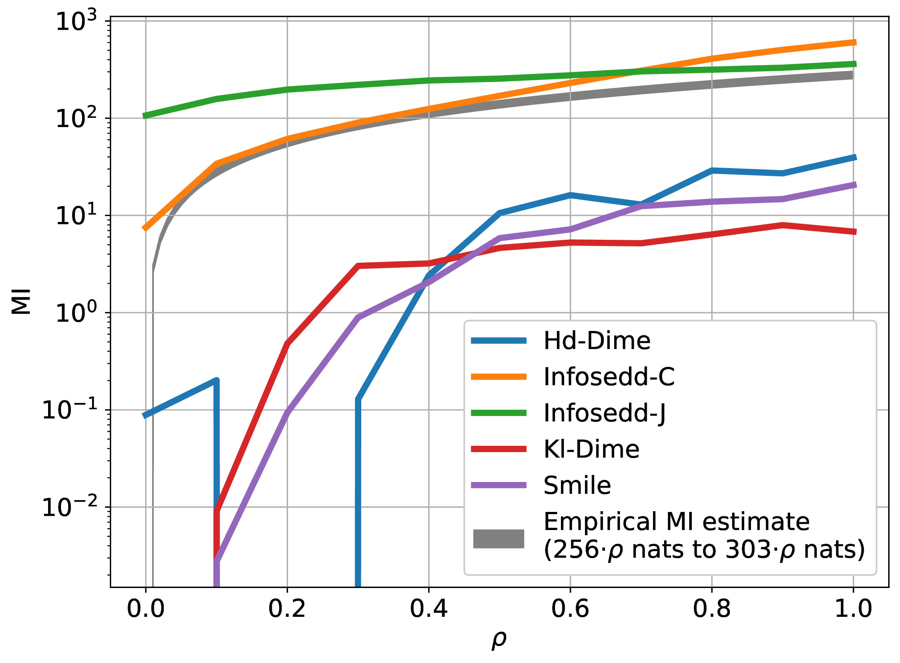
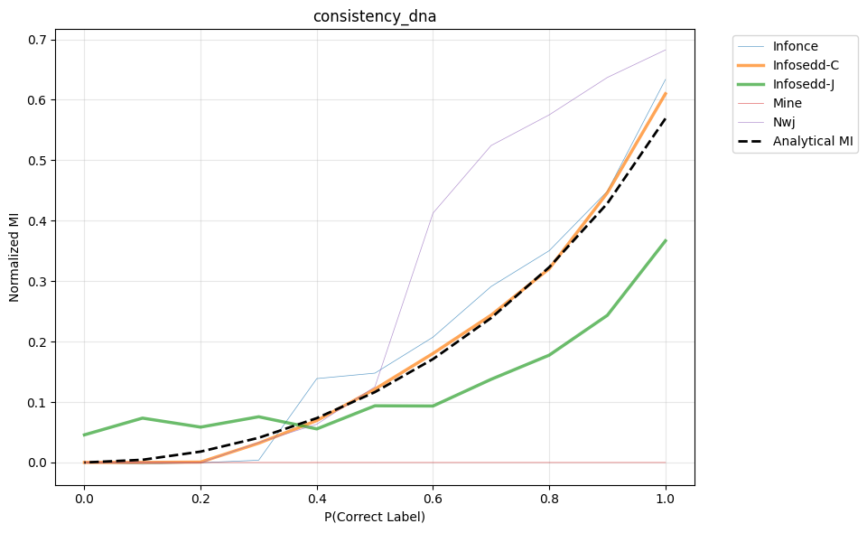
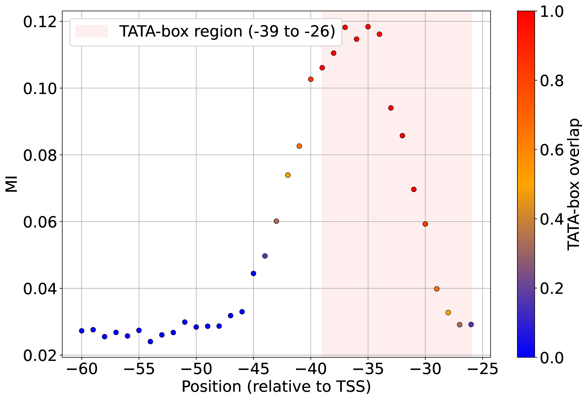

## Overview

- Discrete Diffusion
- Information theory: why do we care?
- INFO-SEDD
- Experimental validation
- Conclusions

## Why bother if we got GPT?

- **Autoregressive models (e.g., GPT)** are powerful but:
  - generate tokens sequentially (slow sampling)
  - are prone to error accumulation (exposure bias)
  - lack global control over structure
- **Discrete Diffusion Models** offer an alternative:
  - enable **parallel generation**
  - can correct mistakes during inference
  - are better suited for **global conditioning**

## Background: Continuous Time Markov Chains (CTMC)

We start from a base distribution $p_{\text{data}}$ and evolve it up to time $T$ with generator matrix $Q_t$:

$$
\frac{d p_t}{dt}=Q_t p_t,\qquad p_0:=p_{\text{data}},\qquad p_T\approx\pi
$$

## Example: Masked Discrete Diffusion {.smaller}

Consider the sentence:

**I really love red kittens**

As $t$ increases, more tokens are masked:

- $t=0.0$: **I really love red kittens**
- $t=0.2$: **I really love red** [MASK]
- $t=0.4$: **I really** [MASK] **red** [MASK]
- $t=0.6$: **I** [MASK] [MASK] **red** [MASK]
- $t=0.8$: **I** [MASK] [MASK] [MASK] [MASK]
- $t=1.0$: [MASK] [MASK] [MASK] [MASK] [MASK]

## Continuous Time Markov Chains

Under standard assumptions, the CTMC admits a reverse process:

$$
\frac{d \bar{p}_t}{dt}= \bar{Q}_t\bar{p}_t,\qquad \bar{p}_0:=\pi,\qquad \bar{p}_T\approx p_{\text{data}}
$$

where

$$
\bar{Q}_t(y,x)=\frac{p_{T-t}(y)}{p_{T-t}(x)}Q_{T-t}(x,y)\quad (x\neq y),
\qquad
\bar{Q}_t(x,x)=-\sum_{y\neq x}\bar{Q}_t(y,x).
$$

## Example: Sampling in Masked Discrete Diffusion {.smaller}

Starting from a fully masked sentence:

[MASK] [MASK] [MASK] [MASK] [MASK]

As $t$ increases, more tokens are revealed:

- $t=0.0$: [MASK] [MASK] [MASK] [MASK] [MASK]
- $t=0.2$: [MASK] **really** [MASK] [MASK] [MASK]
- $t=0.4$: **I really** [MASK] [MASK] [MASK]
- $t=0.6$: **I really** [MASK] **morning** [MASK]
- $t=0.8$: **I really despise morning** [MASK]
- $t=1.0$: **I really despise morning traffic**

## Learning Problem

$$
\text{Unknown score: } \frac{p_{T-t}(y)}{p_{T-t}(x)}
\quad\Rightarrow\quad
\text{approximate with a neural score } s^p_\theta.
$$

We minimize the score entropy loss:

$$
\mathbb{E}\left[\int_0^T\sum_{y\neq X_t}Q_t(X_t,y)\left(s^p_\theta(X_t,t)_y-\frac{p_t(y\mid X_0)}{p_t(X_t\mid X_0)}\log s^p_\theta(X_t,t)_y\right)dt\right].
$$

## Practical issues

$$
X_0 \text{ can be a vector: } [X_0^0,\dots,X_0^i,\dots,X_0^N].
$$

To simulate $X_t\sim p_t(\cdot\mid X_0)$, we perturb each $X_0^i$ independently:

$$
X_t^i \sim p_t^i(\cdot\mid X_0^i)=\text{the }X_0^i\text{-column of }\exp\!\left(\int Q_t^{\text{tok}}\,dt\right).
$$

## Inference in Discrete Diffusion Models {.smaller}

**Objective:** generate a discrete sequence by reversing diffusion from noise to data.

1. **Initialization:** start from a fully noised sequence $X_T$ (e.g., all tokens masked).
2. **Iterative denoising:** for $t=T$ down to $0$, for each position $i$:
   - compute the score $s_\theta(X_t,t)_{i,y}$,
   - estimate reverse transitions
     $$
     p^i(y\mid X_t^i)=\delta_{X_t^i}(y)+\Delta t\,Q_t^{\text{tok}}(X_t^i,y)\,s_\theta(X_t,t)_{i,y},
     $$
   - sample $X_{t-\Delta t}^i\sim p^i(y\mid X_t^i)$.
3. **Output:** final sequence $X_0$.

## Other interesting discrete diffusion models

- MDLM: simplified objective, no time conditioning
- LLaDA: first to scale to 100B parameters
- DiffuLLaMA: fine-tuning strategy to convert autoregressive models
- ReMDM: iterative refinement for self-correction at inference

## Takeaways on NLP applications

::: {.columns}
::: {.column width="50%"}
**Advantages**

- flexible editing
- parallel generation
- slight improvements on some downstream tasks
:::

::: {.column width="50%"}
**Disadvantages**

- generation quality still lags autoregressive models
- iterative denoising can need many steps
:::
:::

## Research Directions

Diffusion models can be a good fit when sequence order is not strictly predefined (e.g., code generation).

Google announced Gemini Diffusion while this deck was being prepared:
<https://deepmind.google/models/gemini-diffusion/>

Discrete diffusion models can also support information-theoretic metric estimation in complex domains.

## Information theoretical quantities

::: {.r-stretch style="display:flex; flex-direction:column; justify-content:space-evenly;"}
**KL divergence** quantifies similarity between distributions.

$$
\mathbb{E}\left[\log\frac{p_{\text{data}}}{q_{\text{data}}}\right],\qquad
\sum_x p_{\text{data}}(x)\log\frac{p_{\text{data}}(x)}{q_{\text{data}}(x)},
$$

$$
\int p_{\text{data}}(x)\log\frac{p_{\text{data}}(x)}{q_{\text{data}}(x)}\,dx.
$$

:::

## Information theoretical quantities

::: {.r-stretch style="display:flex; flex-direction:column; justify-content:space-evenly;"}
**Entropy** quantifies uncertainty of a random variable.

$$
-\mathbb{E}[\log p_{\text{data}}],
\qquad
-\sum_x p_{\text{data}}(x)\log p_{\text{data}}(x),
$$
$$
-\int p_{\text{data}}(x)\log p_{\text{data}}(x)\,dx.
$$
:::

## Information theoretical quantities

::: {.r-stretch style="display:flex; flex-direction:column; justify-content:space-evenly;"}
**Mutual Information (MI)** quantifies nonlinear dependence between random variables.

$$
\mathbb{E}\left[\log\frac{p^{XY}_{\text{data}}}{p^X_{\text{data}}\otimes p^Y_{\text{data}}}\right], \qquad \sum_{x,y} p^{XY}_{\text{data}}(x,y)\log\frac{p^{XY}_{\text{data}}(x,y)}{p^X_{\text{data}}(x)p^Y_{\text{data}}(y)},
$$

$$
\iint p^{XY}_{\text{data}}(x,y)\log\frac{p^{XY}_{\text{data}}(x,y)}{p^X_{\text{data}}(x)p^Y_{\text{data}}(y)}\,dx\,dy.
$$
:::

## Applications

- **Machine Learning:** NLP, bioinformatics
- **Telecommunications:** channel capacity, compression
- **Physics:** analysis of complex systems
- **Statistics:** uncertainty quantification, correlation analysis

## Mutual Information Estimators

- **Classical:** statistical estimators
- **Variational:** neural lower-bound maximization
  $$
  I(X;Y)\geq \sup_\theta \mathbb{E}_{p(X,Y)}[T_\theta(X,Y)]-\log\mathbb{E}_{p(X)p(Y)}[e^{T_\theta(X,Y)}]
  $$
- **Generative:** reuse learned score models from generative modeling

## Generative Mutual Information Estimators

**Continuous data**

- MINDE
- InfoBridge
- Normalizing Flow Estimator

**Discrete data**

- INFO-SEDD

## INFO-SEDD: KL Estimator {.smaller}

::: {.r-stretch style="display:flex; flex-direction:column; justify-content:space-evenly;"}
Using Dynkin's lemma, estimate KL between $p_{\text{data}}$ and $q_{\text{data}}$:

$$
\mathrm{KL}[p_{\text{data}}\|q_{\text{data}}]=
\mathbb{E}\left[
\int_0^T\sum_{y\neq X_t}Q_t(X_t,y)\left(
K\!\left(s^p_\theta(X_t,t)_y\right)+s^q_\theta(X_t,t)_y-s^p_\theta(X_t,t)_y\log s^q_\theta(X_t,t)_y
\right)dt
\right]
$$

with $K(a)=a(\log a-1)$.

Mutual information is a special case of KL divergence.
:::

## INFO-SEDD: Mutual Information Estimator

We set:

$$
p_0:=p_0^{XY},\qquad
q_0:=p_0^X\otimes p_0^Y.
$$

Then both scores are obtained with one model, without adding extra parameters.

## INFO-SEDD: Inference Algorithm

1. Sample $t\sim\mathcal{U}(0,T)$ and training data $X_0,Y_0$.
2. Perturb data: $X_t,Y_t\sim p_t(\cdot\mid X_0,Y_0)$.
3. Compute scores:
   $s^p\leftarrow s^p_\theta([X_t,Y_t],t)$,
   $s^q\leftarrow s^q_\theta([X_t,Y_t],t)$.
4. Accumulate:
   $$
   \sum_{[x,y]\neq[X_t,Y_t]}Q_t([X_t,Y_t],[x,y])\left(K(s^p_{[x,y]})+s^q_{[x,y]}-s^p_{[x,y]}\log s^q_{[x,y]}\right).
   $$
5. Repeat and average.

## INFO-SEDD: Two Variants

::: {.columns}
::: {.column width="50%"}
::: {style="min-height:62vh; display:flex; flex-direction:column; justify-content:center; align-items:center; text-align:center; gap:0.8rem; padding:0 0.6rem;"}
<strong>Joint method (INFO-SEDD-J)</strong>

$$
\large I(X;Y)=
$$
$$
\large =\mathrm{KL}[p_{XY}\|p_X\otimes p_Y]
$$
:::
:::

::: {.column width="50%"}
::: {style="min-height:62vh; display:flex; flex-direction:column; justify-content:center; align-items:center; text-align:center; gap:0.8rem; padding:0 0.6rem;"}
<strong>Conditional method (INFO-SEDD-C)</strong>

$$
\large I(X;Y)=
$$
$$
\large =\mathbb{E}[\mathrm{KL}[p_{Y\mid X}\|p_Y]]
$$
:::
:::
:::

## Synthetic Experiments {.smaller}

We benchmark InfoSEDD on a synthetic benchmark with varying number of dimensions in the data $D$ and mutual information (MI).

| Estimator | InfoSEDD | GAN-DIME | HD-DIME | KL-DIME | MINDE | MINE | NWJ | SMILE |
|---|---:|---:|---:|---:|---:|---:|---:|---:|
| MI=10, D=10 | **10.02** | 12.13 | 9.89 | 8.96 | 11.58 | 9.20 | 7.53 | 11.84 |
| MI=20, D=20 | **20.03** | 21.11 | 13.59 | 7.37 | 28.04 | 7.07 | 6.99 | 22.49 |
| MI=30, D=30 | **28.31** | 19.90 | 12.54 | 7.19 | 23.10 | 8.09 | 6.21 | 19.87 |
| MI=40, D=40 | **39.26** | 21.58 | 12.54 | 6.58 | 29.19 | 7.21 | 5.98 | 19.25 |
| MI=50, D=50 | **47.81** | 16.91 | 10.50 | 5.67 | 30.50 | 6.43 | 5.85 | 18.43 |

**InfoSEDD is the most accurate.**

## Memory Analysis {.smaller}

We collect the peak memory usage during training for each estimator in MB.

| Estimator | InfoSEDD | GAN-DIME | HD-DIME | KL-DIME | MINDE | MINE | NWJ | SMILE |
|---|---:|---:|---:|---:|---:|---:|---:|---:|
| MI=10, D=10 | **346.37** | 645.81 | 645.81 | 645.81 | 440.51 | 645.81 | 645.81 | 645.81 |
| MI=20, D=20 | **687.22** | 1301.98 | 1301.98 | 1301.98 | 876.44 | 1301.98 | 1301.98 | 1301.98 |
| MI=30, D=30 | **1005.66** | 1913.15 | 1913.15 | 1913.15 | 1286.35 | 1913.15 | 1913.15 | 1913.15 |
| MI=40, D=40 | **1345.94** | 2564.33 | 2564.33 | 2564.33 | 1726.25 | 2564.32 | 2564.32 | 2564.32 |
| MI=50, D=50 | **1666.30** | 3180.50 | 3180.50 | 3180.50 | 2138.41 | 3180.49 | 3180.49 | 3180.49 |

**InfoSEDD is the lightest.**

## Runtime Analysis {.smaller}

We collect the runtime for one training epoch for each estimator in seconds.

| Estimator | InfoSEDD | GAN-DIME | HD-DIME | KL-DIME | MINDE | MINE | NWJ | SMILE |
|---|---:|---:|---:|---:|---:|---:|---:|---:|
| MI=10, D=10 | 2.40 | 2.89 | 2.90 | 2.86 | **2.16** | 2.89 | 2.96 | 2.94 |
| MI=20, D=20 | 3.34 | 3.99 | 4.02 | 3.98 | **2.62** | 4.03 | 4.03 | 4.00 |
| MI=30, D=30 | 4.51 | 5.56 | 5.54 | 5.57 | **3.37** | 5.57 | 5.57 | 5.61 |
| MI=40, D=40 | 5.96 | 7.34 | 7.33 | 7.36 | **4.00** | 7.39 | 7.42 | 7.37 |
| MI=50, D=50 | 7.06 | 8.71 | 8.69 | 8.71 | **4.68** | 8.76 | 8.73 | 8.72 |

**InfoSEDD is the second fastest.**

## Application: Entropy Estimation in Ising Models

**Experimental setup**

- simplified Ising model on spin glasses
- $20\times20$ lattice
- temperatures from $1.0K$ to $4.0K$ (linearly spaced)

**Data generation**

- Metropolis-Hastings sampler
- 10,000 samples per temperature

## Application: Entropy Estimation in Ising Models

{fig-align="center" width="65%"}

## Textual Data Experimental Settings

We use SummEval: 16 datasets from 16 summarizers, all with the same reference texts and human annotations:

- **Consistency:** summary content entailed by reference
- **Relevance:** capture important content while penalizing irrelevant details
- **Coherence:** quality of all sentences together
- **Fluency:** quality of individual sentences

## Ensuring Consistency and Reliability - Textual Data {.smaller}

::: {.columns}
::: {.column width="45%"}
**Key idea**

- assess consistency/reliability without ground truth
- create datasets where text-summary pairs are correct with probability $\rho$
- MI should increase linearly with $\rho$, yielding near-perfect correlation
:::

::: {.column width="55%"}
| Estimator | Correlation |
|---|---:|
| INFO-SEDD-J | 0.984 |
| KL-DIME | 0.968 |
| INFO-SEDD-C | 0.968 |
| SMILE | 0.959 |
| HD-DIME | 0.931 |
| GAN-DIME | 0.759 |
| NWJ | 0.710 |
| MINDE | -0.112 |
| MINE | -0.808 |
:::
:::

## Ensuring Consistency and Reliability - Textual Data {.smaller}

::: {.columns}
::: {.column width="45%"}
**Getting an idea of expected MI**

- entropy rate of text is known up to uncertainty (gray band in the figure)
- competitors underestimate realistic MI
- **InfoSEDD estimates a realistic amount of information**
:::

::: {.column width="55%"}
{width="100%"}
:::
:::

## Application: Model Selection in Text Summarization {.smaller}

::: {.columns}
::: {.column width="50%"}
**Pearson**

|  | COH | CON | FLU | REL | OVR |
|---|---:|---:|---:|---:|---:|
| INFO-SEDD-C | 0.21 | 0.74 | 0.68 | 0.41 | 0.57 |
| INFO-SEDD-J | -0.09 | 0.55 | 0.46 | 0.29 | 0.32 |
:::

::: {.column width="50%"}
**Kendall's Tau**

|  | COH | CON | FLU | REL | OVR |
|---|---:|---:|---:|---:|---:|
| INFO-SEDD-C | 0.10 | 0.50 | 0.13 | 0.20 | 0.22 |
| INFO-SEDD-J | 0.05 | 0.49 | 0.15 | 0.22 | 0.24 |
:::
:::

MI is an unsupervised metric that can mimic expensive human evaluations.

## Ensuring Consistency and Reliability - DNA Sequences {.smaller}

::: {.columns}
::: {.column width="45%"}
**Key idea**

- process a human-vs-worm dataset with correct labels assigned with probability $\rho$
- each entry of the dataset is a DNA sequence and a label (promoter / non-promoter)
- approximate true MI with a classifier
:::

::: {.column width="55%"}
{width="100%"}
:::
:::

## Application: Finding Motifs in DNA Promoter Sequences {.smaller}

::: {.columns}
::: {.column width="50%"}
**Preliminaries**

- promoter sequences are DNA regions where proteins bind
- motifs like `gattaca` can drive protein binding
- motifs tend to appear in preferential positions
- focus: *Arabidopsis thaliana*, with known TATA-box motif
:::

::: {.column width="50%"}
**Method**

- define $X$: promoter sequence, $Y$: label (promoter / non-promoter)
- estimate $I(X_{[i:i+L]},Y)$ while sliding $i$ across sequence positions
- high-MI intervals reveal probable motif locations
:::
:::

## Application: Finding Motifs in DNA Promoter Sequences

{fig-align="center" width="75%"}

## Takeaways

INFO-SEDD:

- performs well across multiple challenging scenarios
- estimates different information metrics with minimal changes
- estimates MI between different subsets of random vectors with one training run
- enables applications across disparate domains

## Thank you {.center .middle}

## Practical issues {.smaller}

::: {.columns}
::: {.column width="50%"}
- columns of $\exp\!\left(\int Q_t^{\text{tok}}dt\right)$ should be computed on demand, not stored
- those columns must also be fast to compute
:::

::: {.column width="50%"}
$$
Q_t^{\text{tok}}=\sigma(t)
\begin{bmatrix}
-1 & 0 & \cdots & 0 & 0\\
0 & -1 & \cdots & 0 & 0\\
\vdots & \vdots & \ddots & \vdots & \vdots\\
0 & 0 & \cdots & -1 & 0\\
1 & 1 & \cdots & 1 & 0
\end{bmatrix}
$$
:::
:::

## The Ising Model {.smaller}

**Definition:** the Ising model uses spins $s_i\in\{-1,+1\}$.

**Energy (Hamiltonian):**

$$
H=-J\sum_{\langle i,j\rangle} s_i s_j - h\sum_i s_i.
$$

where:

- $J$: interaction strength between neighboring spins
- $\langle i,j\rangle$: sum over adjacent spins
- $h$: external magnetic field

**Key properties**

- entropy is analytically known (in constrained settings)
- samples can be generated with Monte Carlo methods (e.g., Metropolis)
